# TSR-1: A Preliminary Systems Engineering Study of an Autonomous Lunar Service and Recovery Rover for Distributed Surface Infrastructure

**TODARO CORP. — TSR-1 Lunar Autonomous Service & Recovery Rover**

> TSR-1 is an independent conceptual engineering study by Todaro Corp. References to NASA, ESA and other organizations are used solely as technical and architectural context.

*Generated by `paper/build_paper.py` from `simulations/results/` (run with `simulations/build_all.py`). Repository
paths in the text refer to the study repository, where every model, parameter and derivation can be inspected.*

## 1. Abstract

Distributed infrastructure at a south-polar lunar base — power, communication, science and robotic assets spread
over tens of kilometres — will suffer faults that cannot wait for a crew mission or an Earth spare: an asset that
loses power has days, not months, before thermal damage, and an immobilised vehicle has no external rescue
capability today. This study asks whether a dedicated autonomous servicing and recovery rover, TSR-1, can materially
increase the availability and life of such infrastructure while reducing crew EVA, asset loss and Earth logistics,
within credible mass, power, thermal and mobility limits. Following a systems-engineering workflow — operational
need, concept of operations, 48 traceable requirements, ten formal trade studies, physics-based subsystem
models, 46 budget-closure checks, an adversarial design review and a discrete-event Monte Carlo value
model — the study derives a 1,207 kg (delivered) six-wheel rocker-bogie rover with two 20 kg-class
dexterous arms, a 150 kg cable-stayed crane, a 3 kW power-transfer module on the 120 VDC interoperability bus,
deployable keep-alive power modules and an anchored 4 kN winch. Two original design hypotheses failed: a heavy
service arm is mass-inefficient in lunar gravity, and towing is traction-limited on slopes (anchored winching raises
the recoverable fraction of sampled immobilisation cases from 27 % to
92 %). The design closes (46/46 checks) with
20.7° gradeability in nominal soil (15.6° conservative). For a
30-asset base over ten years, one TSR-1 raises mean availability from 0.69 to 0.76
(gain P10/P50/P90 1.8/7.0/14.5 percentage points), cuts preventable
asset losses from 21.7 to 8.9 and Earth-supplied replacement mass from
13.0 t to 9.5 t, but reduces crew EVA only modestly. The logistics
break-even is ≈ 12 serviceable assets; the benefit depends most on assets carrying
robot-serviceable interfaces and on an adequate inventory of keep-alive modules. The verdict is **feasible with
identified technology development** (regolith anchors, cold- and dust-tolerant actuators, verified servicing
autonomy, dust-tolerant power connectors), and conditionally justified; the review also found that a host-mounted
service-and-recovery kit is preferable to a dedicated vehicle wherever a utility-rover host can respond within an
asset's survival time.

*TSR-1 is an independent conceptual engineering study by Todaro Corp. References to NASA, ESA and other organizations are used solely as technical and architectural context.*

## 2. Introduction

The current lunar exploration architectures move from sorties to sustained presence. NASA's Moon Base plan places
power arrays, communication towers, landers, rovers and science stations around the south pole during the
early 2030s [@S006; @S007; @S054]; ESA, JAXA and commercial partners contribute landers, rovers and relay services
[@S018; @S047; @S058]. Sustained operation of such a distributed system raises a question that sortie missions never
had to answer: who maintains it? On the International Space Station, maintenance absorbed more than 4000 crew hours
in the first five years, and external robotics already performed roughly twice the external maintenance hours of
EVA crews [@S049]. NASA's capability-gap work lists autonomous inspection, maintenance and repair, dust-tolerant
interfaces and standardised architectures among the gaps for uncrewed surface operations [@S001; @S051], and the 2026
civil space shortfall ranking places surviving the lunar night first [@S010].

TSR-1 is a hypothesis put forward by Todaro Corp.: a dedicated autonomous rover that inspects, powers, repairs,
cleans and recovers other surface assets. This paper does not set out to prove that hypothesis. It asks what such
a vehicle would have to be to work, whether that vehicle closes in mass, power, thermal and mobility, and whether it
would actually improve infrastructure availability and logistics enough to justify itself — and it reports where
the answer is negative. The engineering evidence is a reproducible Python model set with automated tests; every
number in this paper is generated from those models (`simulations/run_all.py`), and every parameter is recorded with
its provenance in a central register (`engineering/parameter_register.csv`).

Throughout, values are labelled by provenance: SOURCE-DERIVED (from a cited document), CALCULATED (model output),
ENGINEERING ASSUMPTION (no source; range carried), DESIGN DECISION (selected by trade) or ESTIMATE (engineering
judgement with range). Because the study environment blocked full-text access to agency servers, sources were read
through search-engine excerpts; each reference carries its access label (Section 29) and the consequences are
discussed in Section 26.

## 3. Operational Need

Three observations establish that the need is real; none of them, alone, establishes that a dedicated vehicle is
the right answer.

1. **Uncrewed operations are the norm.** Crew presence at the base is expected to be intermittent (assumption
   A-07: zero to two surface missions per year of about 30 days). The NASA gap study frames the uncrewed-operations
   gaps around reducing "reliance on humans to perform tasks" under communication delay [@S001]; the uncrewed
   support taxonomy names lifting, servicing, powering, inspecting, cleaning and safing, with increased
   infrastructure availability as an explicit objective [@S051].
2. **Faults become losses quickly.** An unpowered small asset has a survival time of the order of 50 h in darkness
   (VIPER class, [@S035]); a parked rover in soft regolith can be permanently lost, as Spirit was [@S046]. No
   external recovery capability exists for lunar vehicles.
3. **Dust degrades everything over time.** Apollo experience shows dust clogging mechanisms, abrading seals and
   degrading thermal control [@S022]; sub-monolayer deposits measurably change radiator absorptance [@S062].
   Electrodynamic dust shields have now been demonstrated on the Moon [@S019], but cleaning still needs a carrier.

The first of these is decisive for the architecture: whatever performs the service must be useful when no crew is
present and must survive long communication gaps (direct-to-Earth availability at the pole ≈ 51 % [@S073]).

## 4. Existing Capability Landscape

**Overlapping architecture elements.** NASA's 2025 logistics white paper and architecture update define a robotic
*Lunar Utility Rover* that would move "100s kg" to "1000s kg" of cargo and "could support continuous presence ... with
capabilities to maintain, repair, and service other exploration systems" [@S004; @S005]. The Lunar Terrain Vehicle
(LTV) programme selected two crew-capable vehicles with uncrewed modes, ten-year life and 800 kg-class payload
[@S036; @S055]; one of them derives from a platform that carries three robotic payload interfaces [@S037]. TSR-1
therefore cannot claim novelty of mission; it must justify itself either as a specialised configuration of the
utility-rover class or as a kit that such a vehicle carries. This tension is examined in the design review
(Section 22, CDR-01).

**Servicing heritage.** The only operational dual-arm servicing robot, Dextre, weighs 1662 kg and works in
microgravity with OTCM end-effectors [@S067]. Planetary surface arms are lighter and slower — the Perseverance arm
carries a 45 kg turret at ≈ 2 m [@S066] — and none is rated for heavy lifts under gravity. The Lunar Surface
Manipulation System showed that a cable-stayed crane can lift a tip payload many times its own mass [@S015]. Cold-
tolerant bulk-metallic-glass gears have operated without heaters at −173 °C [@S040], whereas heritage actuators must
be warmed to at least −55 °C before operation [@S041].

**Interfaces.** Power interoperability is defined at 120 VDC (with 28 VDC for small loads) by ISPSIS [@S011]; NASA
Glenn's grid work notes that 120 VDC exchange is limited to distances below 100 m and proposes 3 kVAC distribution
with bidirectional converters [@S012]. Robotic interfaces are classed by IERIIS on an ISO 9409-1 pattern [@S013];
androgynous interfaces such as HOTDOCK combine mechanical, power and data paths [@S048]. Communications follow
LunaNet and Moonlight relay services [@S017; @S018]. There is no lunar surface servicing standard today, which —
as Section 21 shows — is the largest single determinant of TSR-1's value.

**Mobility heritage.** The Apollo LRV is the only lunar vehicle with measured energy consumption (≈ 1.6 A·h/km at
36 V, [@S060]) and demonstrated 25° slopes [@S027]; VIPER and the LTV class define current practice for polar
rovers [@S035; @S036].

## 5. Research Question

*Can a dedicated autonomous lunar servicing and recovery rover materially increase the availability and operational
lifetime of distributed lunar surface infrastructure while reducing crew EVA requirements, asset loss, downtime and
Earth-supplied maintenance logistics, within physically and technologically plausible mass, power, thermal and
mobility constraints?*

The question has an engineering half (does a vehicle with the required functions close?) and a value half (does it
change infrastructure outcomes enough?). The study treats both as open: a vehicle that closes but adds little value,
or a valuable function that cannot be packaged credibly, would each be a negative answer. Five Todaro hypotheses
were evaluated explicitly rather than assumed: (A) asymmetric dual arms, (B) recovery and towing with stabilisation
anchors, (C) emergency power through standard interfaces, (D) a modular service spine and (E) multi-standard
interfaces with defined compatibility levels L0–L3.

## 6. Design Methodology

The work followed the sequence research → requirements → models → trades → design freeze → review → revision:

1. **Evidence base.** 97 sources registered with hierarchy rank and access label
   (`research/source_register.csv`); a literature review and programme context (`research/`).
2. **Need and ConOps.** Stakeholders, nine target asset classes, compatibility levels L0–L3 and eight design reference
   missions (DRM-1..DRM-8; `engineering/conops.md`).
3. **Requirements.** 48 mission and system requirements, each with statement, rationale, source and
   verification method, generated from model outputs so that numbers in requirements equal numbers in the design
   (`requirements/`).
4. **Models.** Terramechanics (Bekker pressure–sinkage, Wong–Reece wheel stress integration, Janosi–Hanamoto shear
   [@L001; @L003; @L004]), static stability, manipulator and crane sizing, soil anchors (Rankine passive pressure,
   plate breakout), power and cable sizing, lumped thermal, structure, mass with AIAA S-120A growth allowances
   [@S052], reliability and a discrete-event value model (`src/tsr1/`, 190 registered parameters: SOURCE 56, ASSUMPTION 54, ESTIMATE 38, DESIGN 24, CALCULATED 18).
5. **Trade studies.** Ten formal trades with direct engineering comparison where scoring would be arbitrary
   (`trade_studies/`).
6. **Closure.** 46 independent checks that component sums reproduce totals and that each claimed
   capability is supported by the corresponding physics (directive §44; `simulations/results/closure.json`).
7. **Adversarial review.** The team switched role to a hostile review board (twenty objections, CDR-01..CDR-20),
   and the design was revised where objections held (`CRITICAL_DESIGN_REVIEW.md`).
8. **Uncertainty.** Parameter ranges, tornado sensitivities, mass Monte Carlo and epistemic Monte Carlo over the
   value model's uncertain inputs.

All stochastic analyses are seeded; `simulations/build_all.py` regenerates every result, figure and document,
including this paper.

## 7. Lunar Environmental Model

The environment model (`src/tsr1/environment/lunar.py`) carries every quantity as a nominal value with a range.
Soil parameters for the disturbed surface follow the Lunar Sourcebook trafficability table [@S023; @S024], in-situ
strength by depth follows the same source, and a reduced-gravity penalty is applied to traction because 1-g tests
over-predict lunar drawbar pull by about 20 % and under-predict sinkage by up to 40 % [@S043; @S044]. Three soil cases are
used: *nominal*, *conservative* (lower friction and cohesion, reduced-gravity penalty) and a *weak* bound.

| Quantity | Nominal | Range | Provenance | Basis |
|---|---|---|---|---|
| gravity | 1.62 m/s^2 | — | SOURCE | L018 |
| cohesion c | 170 Pa | 100–1000 | SOURCE | S023 |
| friction angle φ | 35 deg | 30–46 | SOURCE | S023 |
| k_c | 1400 N/m^(n+1) | 700–2800 | SOURCE | S023 |
| k_φ | 820000 N/m^(n+2) | 410000–1640000 | SOURCE | S023 |
| sinkage exponent n | 1 | 0.8–1.2 | SOURCE | S023 |
| shear modulus K | 0.0178 m | 0.01–0.025 | SOURCE | S023 |
| unpowered asset survival time | 50 h | 24–120 | ASSUMPTION | A-14 (S035 VIPER ~50 h) |
| best-site illumination (2 m) | 0.9227 | — | SOURCE | S030 |
| illumination at parked asset | 0.75 | 0.5–0.92 | ASSUMPTION | A-34 (upper bound S030 best ridge 0.92 at 2 m; lower bound for infrast |
| longest dark period at parked asset | 72 h | 24–120 | ASSUMPTION | A-35 (S030: longest darkness 3-5 days at the best sites; no site-speci |
| relay slant range | 10000 km | 3000–20000 | ASSUMPTION | A: elliptical lunar relay orbit slant range (no orbit data retrieved f |

Thermal bounds span permanently shadowed regions below 40 K [@S032] to sunlit polar rims near 300 K, with equatorial
extremes (≈ 95–390 K) as an outer bound [@L016]. Illumination at the best ridge sites reaches 92 % (2 m) to 96 % (10 m),
with longest darkness of 3–5 days [@S030]. Galactic-cosmic-ray dose is 13.2 µGy/h in silicon [@S033]; the design case
of 10 krad(Si) over ten years with a radiation design margin of two is dominated by solar particle events
(assumption A-24). Micrometeoroid flux scales from a recent polar-base analysis [@S061]. Dust is modelled through its
effects — radiator absorptance growth by a factor 1.4–2.6 at 25 % coverage [@S062], mechanism torque and life
penalties [@S021] — rather than through particle transport.

## 8. Mission Requirements

15 mission requirements (MR) and 33 system requirements (SR) were derived from the need, the ConOps and the
source base; each carries an ID, statement, rationale, source and verification method, and is traced to the design
element and model that satisfies it (`requirements/requirements_traceability.csv`). Numerical values in requirement
statements are written by the requirement generator from model outputs (`simulations/results/design_values.json`),
so a requirement cannot quote a capability the model does not show. Requirements verified by each method (several
use more than one): analysis 21, test 31, inspection 10, demonstration 8.

| ID | Mission requirement | Verification |
|---|---|---|
| MR-01 | TSR-1 shall increase the time-averaged availability of serviceable surface assets in its service area relative to an otherwise identical base without TSR-1, by at least 1.8 percentage points for the reference base of 30 assets. | A |
| MR-02 | TSR-1 shall perform all nominal inspection, servicing, emergency-power and recovery functions without crew EVA support. | D |
| MR-03 | TSR-1 shall inspect assets of classes AC-1 to AC-9 at compatibility levels L0–L3 using visible, thermal-infrared and 3-D imaging, and report anomalies with location and severity. | D |
| MR-04 | TSR-1 shall remove and replace robot-compatible ORUs of mass up to 150 kg on L2 and L3 assets. | T |
| MR-05 | TSR-1 shall deliver temporary electrical power to a disabled asset through an ISPSIS 120 VDC compatible interface at up to 3 kW continuous for at least 10 h at keep-alive load (300 W). | T |
| MR-06 | TSR-1 shall recover or reposition immobilized vehicles within the envelope: free-rolling vehicles up to 4.8 t and brake-locked vehicles up to 2.3 t on slopes ≤ 15° (anchored winch, FoS 1.5); 450 kg-class rovers with wheels embedded ≤ 0.15 m after ramp excavation; direct towing of free-rolling vehicles ≤ 1.5 t on level ground; P(sampled immobilisation case recoverable) = 0.92. | A,T |
| MR-07 | TSR-1 shall remove regolith dust from asset solar-array, radiator and optical surfaces such that the residual area coverage is ≤ 5 %. | T |
| MR-08 | TSR-1 shall execute service tasks under task-level human supervision only (no continuous teleoperation) and shall safely continue to the next hold point or abort predefined tasks during Earth-link outages up to 72 h and local-network outages up to 24 h. | D |
| MR-09 | TSR-1 shall have an operational design life of 10 years on the lunar surface. | A |
| MR-10 | TSR-1 shall operate in the south-polar environment (sunlit ridges, shadowed terrain) including PSR excursions of up to 8 h, and shall survive 120 h without external power or sunlight. | A,T |
| MR-11 | TSR-1 shall be deliverable as a single payload on a commercial lander with ≤ 3.0 t surface payload capacity (threshold) and ≤ 1.5 t (goal), including accommodation hardware. | A,I |
| MR-12 | TSR-1 shall use open interface standards: ISPSIS for power, LunaNet/CCSDS for communications and PNT, and ISO 9409-1/IERIIS-derived mechanical tool interfaces with adapters; it shall not require proprietary-only interfaces on serviced assets. | I |
| MR-13 | TSR-1's life-limited and failure-prone items shall be replaceable at ORU level by another TSR-class vehicle or by crew without special tools. | D |
| MR-14 | TSR-1 shall not create a catastrophic hazard to crew or to other assets; all motion shall be bounded by a deterministic safety layer independent of high-level autonomy. | A,T |
| MR-15 | TSR-1 shall serve assets within a service radius of 10 km of its home charging node and reach any such asset within 10 h of task approval. | A,D |

Two requirements were changed by the design review: the slope requirement now states a nominal and a conservative
value (CDR-15), and the service radius is tied to the demonstrated effective speed (CDR-13).

## 9. System Architecture

The models drove the architecture in a specific order (`engineering/architecture.md`):

1. **Traction, not suspension, limits slopes.** Soil shear strength and compaction resistance both scale with wheel
   load, so gradeability is a soil property almost independent of suspension type (TS-01). The lightest
   architecture that still supports self-repair and stabilisation — a six-wheel rocker-bogie with body lowering — was
   therefore selected.
2. **The vehicle is light compared with the forces it must apply.** At 1.62 m/s² a 1.25 t rover weighs only ≈ 2 kN.
   Lifting is done by a crane working in tension and compression, dexterity by light arms, and ground reaction for
   winching by spades and anchors rather than by vehicle weight (TS-03, TS-04, TS-05).
3. **Value comes from preventing losses, which needs power.** The value model shows that the largest benefit is
   keeping unpowered assets alive until they can be repaired. The 120 VDC power-transfer module and deployable
   keep-alive modules are therefore core functions (TS-06, TS-07).
4. **Interoperability is decisive.** Robotic module-replacement success falls from ≈ 0.96 at L3 to ≈ 0 at L0; TSR-1
   adopts open standards and carries adapters, and the main programmatic recommendation targets asset interfaces.

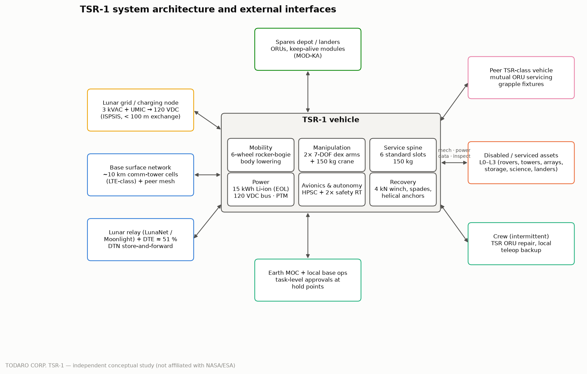

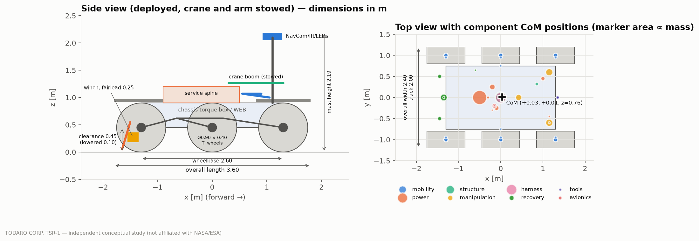

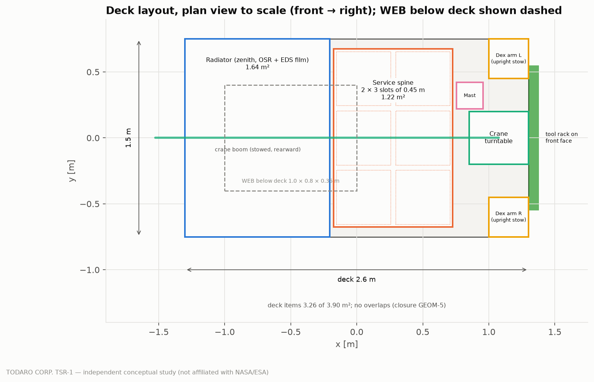

**Deck layout.** A single layout definition (`src/tsr1/design/layout.py`) feeds the mass and centre-of-mass model, the
crane geometry in the stability model, the closure checks and Figure 3: the zenith radiator takes the full deck
width at the rear; the service spine is a 2 × 3 grid of 0.45 m slots mid-deck; the crane turntable, mast and both arm
bases share the front strip; tools hang on the chassis front face. The arms stow upright at the front corners and the
crane boom stows rearward over the spine (shading 3.3 % of the radiator). Inside the chassis the warm
electronics box sits under the radiator, 0.5 m aft of centre, which keeps the centre of mass at
x = +0.03 m and the heaviest-axle ground pressure within 7 kPa. The design review found that the pre-review
deck allocation did not fit (CDR-21); the area-only check had hidden the conflict.

The functional architecture has nine functions — traverse and localise; inspect and diagnose; emergency power and
charging; service ORUs; clean; recover and reposition; self-maintain and peer-service; survive; communicate and be
supervised — each allocated to identified hardware and interfaces (`engineering/interfaces.md`, eleven external and
seven internal interfaces).

## 10. Mobility

**Model.** Each wheel is solved with the Wong–Reece stress integration over the contact arc (normal stress from
Bekker pressure–sinkage, shear from Janosi–Hanamoto), with grousers represented by an increased shear radius; vehicle
equilibrium on a slope is found by distributing load over the axles and solving for the slip at which net traction
balances the gravity component (`src/tsr1/mobility/`). The model was checked against the only lunar vehicle energy datum:
the Apollo LRV's ≈ 1.6 A·h/km at 36 V [@S060] gives an empirical calibration factor k_cal = 0.62 on the model's
wheel energy, which is applied to all driving-energy estimates. The reduced-gravity penalty of [@S043] is part of
the conservative soil case.

**Trade TS-01 (mobility architecture).** Four architectures were sized to the same mission:

| Candidate | Delivered mass [kg] | Mobility mass [kg] | Slope, nominal [°] | Slope, conservative [°] | Slope, one drive failed [°] | P(mobility retained, 10 yr) |
|---|---|---|---|---|---|---|
| M1 6-wheel rocker-bogie (passive) | 1,155 | 233 | 19.8 | 14.7 | 16.5 | 0.82 |
| M2 6-wheel rocker-bogie + body lowering + differential lock | 1,185 | 256 | 19.8 | 14.7 | 16.5 | 0.82 |
| M3 6-wheel independently articulated legs (active) | 1,301 | 344 | 20.7 | 15.5 | 17.4 | 0.82 |
| M4 4-wheel independent active suspension | 1,286 | 339 | 20.7 | 15.6 | 14.9 | 0.72 |

Gradeability barely depends on suspension type because both traction and compaction resistance scale with wheel
load. The six-wheel rocker-bogie with body lowering and a differential lock (M2) costs ≈ 30 kg more than the passive
version but provides what servicing and recovery need — a lowered, skid-supported work posture and wheel unloading
for self-repair — and was selected. The active alternatives add 101–116 kg for 0.9° more slope.

**Trade TS-02 (wheels).** Rigid titanium wheels Ø0.90 × 0.40 m with eighteen 20 mm grousers were
selected from a sweep of diameter and width against the ground-pressure rule (≤ 7 kPa, [@S023]) and drawbar pull at
40 % slip; a smaller Ø0.8 m wheel violated the pressure rule at the final mass. Wire-mesh (LRV, [@S029]) and
superelastic spring tyres were rejected for dust ingress, unproven ten-year fatigue and low model confidence.

**Results.** Contact pressure 6.64 kPa and static sinkage 18 mm at
the mean wheel load of 337 N (6.80 kPa under the
heaviest-loaded axle at 20 % slip, closure MOB-1). Maximum slope at slip ≤ 0.4: **20.7° nominal soil,
15.6° conservative, 10.3° weak bound**; with one or two drives failed 17.4° /
13.4°. Drive actuators are rated at 210 N·m (soil-limited torque
168 N·m × 1.25). Direct tow capacity in nominal soil is small: 0°: 766 N; 5°: 586 N; 10°: 402 N; 15°: 215 N; 20°: 26 N. Driving energy including
hotel loads is 0.32 kWh/km at an effective 1.26 km/h, which dominates sortie energy
(Section 13).

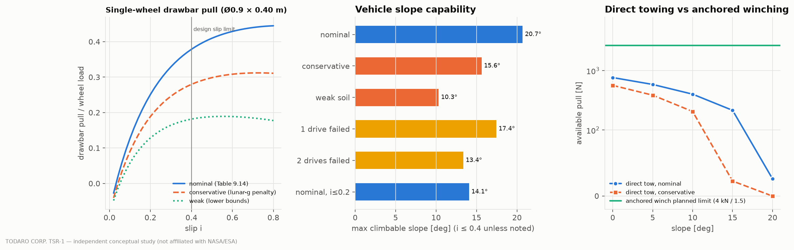

## 11. Manipulation and Servicing

**Sizing in lunar gravity.** Serial arms were sized by worst-case gravity torque at full extension × 1.15 dynamic ×
2.0 motorisation factor, with actuator mass from a torque-density relation (25 N·m/kg nominal, 15–40 N·m/kg range)
and link tubes sized for deflection (`src/tsr1/manipulation/arm.py`). The crane is a slewing, luffing, cable-stayed
boom whose members carry tension and compression only, following the LSMS principle [@S015].

**Trade TS-03 (manipulator architecture)** — task coverage is weighted by DRM frequency; no arbitrary scores:

| Architecture | Mass [kg] | Joints | Weighted task coverage | Coverage per kg | Backup after arm failure |
|---|---|---|---|---|---|
| A1 one general-purpose 7-DOF arm (100 kg) | 102.2 | 7 | 0.83 | 0.008 | no |
| A2 two identical dexterous arms | 50.9 | 14 | 0.78 | 0.015 | yes |
| A3 asymmetric heavy arm + dexterous arm | 158.3 | 13 | 1.00 | 0.006 | yes |
| A4 dexterous arm + crane boom | 45.4 | 10 | 0.94 | 0.021 | no |
| A5 dexterous arm + passive fixtures | 33.4 | 7 | 0.75 | 0.022 | no |
| A6 dexterous arm + crane boom + passive fixtures | 53.4 | 10 | 0.94 | 0.018 | no |
| A7 two dexterous arms + crane boom | 70.8 | 17 | 0.96 | 0.014 | yes |

The asymmetric heavy-plus-dexterous pair (Todaro hypothesis A) achieves full coverage but at 158 kg, because a
150 kg-rated serial arm needs ≈ 1.5 kN·m shoulder actuators even in lunar gravity. Replacing the heavy arm by the crane
recovers almost all coverage at a fraction of the mass. **Selected: A7, two identical 7-DOF dexterous arms plus the
crane.** The second dexterous arm (+25 kg over A4) removes the arm single-point failure and enables two-handed
connector and ORU work. Hypothesis A therefore failed in its asymmetric form and survived as a symmetric pair.

**Frozen manipulators.** Each dexterous arm: reach 1.60 m, 20 kg rated payload, tip deflection
1.9 mm, shoulder torque 98 N·m (rating 197 N·m),
27.0 kg CBE, titanium links. Crane: 2.56 m reach, 150 kg hook load, luff-cable tension
751 N, 19.9 kg CBE. Twelve tools are carried; each maps to at least one DRM step or recovery
scenario (`engineering/subsystem_specs/tools.md`).

**Servicing success by compatibility level (hypothesis E).** Task success is the product of step probabilities
(approach, diagnose, engage interface, release fasteners, extract/insert, mate connectors, test), each with a range
by level (assumption A-31; no lunar servicing statistics exist). Median success probabilities:

*Robot (TSR-1):*

| Task | L0 | L1 | L2 | L3 |
|---|---|---|---|---|
| oru replace | 0.00 | 0.12 | 0.78 | 0.96 |
| dust clean | 0.93 | 0.96 | 0.98 | 0.99 |
| emergency power | 0.16 | 0.91 | 0.99 | 1.00 |
| recovery rig | 0.80 | 0.95 | 0.98 | 1.00 |
| inspection | 0.44 | 0.78 | 0.84 | 0.94 |

*Crew EVA (for comparison):*

| Task | L0 | L1 | L2 | L3 |
|---|---|---|---|---|
| oru replace | 0.17 | 0.68 | 0.89 | 0.96 |
| dust clean | 0.97 | 0.98 | 0.99 | 0.99 |
| emergency power | 0.57 | 0.97 | 1.00 | 1.00 |
| recovery rig | 0.92 | 0.98 | 0.99 | 1.00 |
| inspection | 0.71 | 0.86 | 0.89 | 0.94 |

Robotic ORU replacement is practically impossible on non-service-ready (L0) assets and reliable on L2/L3 assets;
crews are far less sensitive to interface level. Whether lunar assets will be designed to L2/L3 is the single most
important external condition for TSR-1 (Section 21).

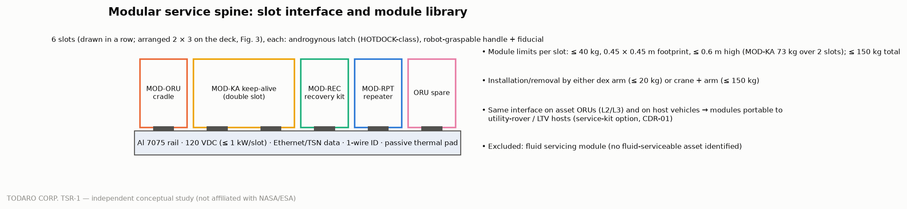

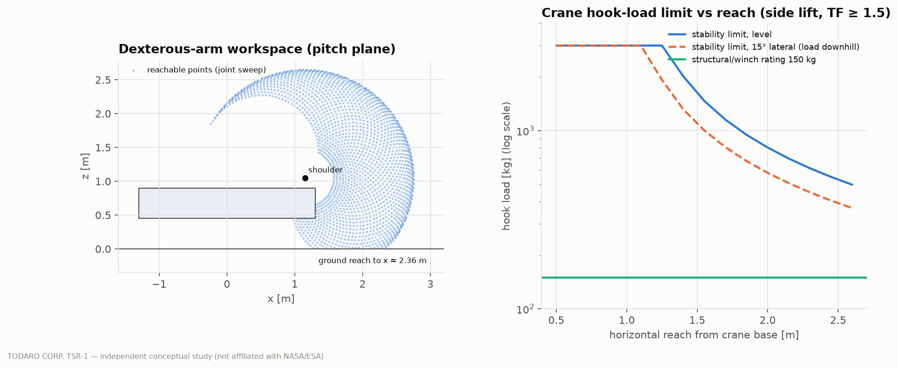

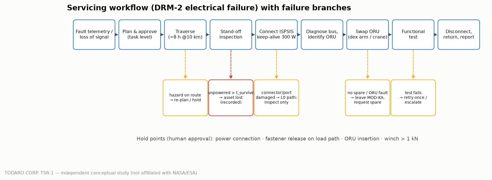

## 12. Recovery System

**Why towing fails.** In nominal soil the whole vehicle can generate only 215 N
of drawbar pull on 15° (Section 10) — less than one tenth of the force needed to drag a 450 kg vehicle with embedded
wheels. Terrestrial-style towing (part of hypothesis B) is therefore limited to light, free-rolling targets on level
ground.

**Anchored winching.** The adopted system pulls with a 4 kN winch while the rover is lowered and restrained by two
rear spades and two helical anchors installed in front, with straps to the front hard points. Spade capacity is
modelled by Rankine passive earth pressure with a shape factor, helical anchors by plate breakout (N_q* 10–40,
ESTIMATE) with the in-situ strength profile of [@S023]; embedded-wheel extraction resistance is bounded by a
step-climb model and a Bekker compaction model, whose spread is carried as uncertainty
(`src/tsr1/recovery/towing.py`). Restraint capacity is 5.9 kN in median soil and
3.9 kN at half strength.

**Trade TS-05 (recovery architecture).** Probability that a sampled immobilisation case (target mass, slope,
embedment, soil) is recoverable within the line-pull and restraint limits:

| Restraint concept | P(recoverable), median soil | Half-strength soil | Range over resistance bounds | Added mass [kg] |
|---|---|---|---|---|
| R0 direct towing (drive) | 0.27 | 0.27 | 0.24–0.35 | 3.0 |
| R1 winch + braked wheels | 0.51 | 0.51 | 0.40–0.65 | 0.0 |
| R2 winch + braked wheels + lowered skid | 0.50 | 0.50 | 0.40–0.65 | 9.4 |
| R3 winch + braked wheels + 2 rear spades | 0.84 | 0.67 | 0.67–0.89 | 17.6 |
| R4 winch + 2 spades + 2 helical anchors | 0.92 | 0.84 | 0.77–0.96 | 25.6 |
| R5 winch + 2 spades + 4 helical anchors | 0.93 | 0.90 | 0.79–0.96 | 29.6 |

**Selected: R4.** The second anchor pair (R5) adds little; braked wheels alone (R1) are far short. This is the
honest outcome for hypothesis B: recovery works, but only with ground anchoring, which is TRL 3 — no quantitative
lunar regolith anchor capacity exists in the literature [@S045].

**Trade TS-04 (stabilisation).** Outriggers were compared with locked wheels, body lowering and spades:

| Option | Added mass [kg] | Crane side capacity at 15° [kg] | Winch pull limit [kN] | Deploy time [min] |
|---|---|---|---|---|
| S0 locked wheels only | 0 | 377 | 0.98 | 1 |
| S1 body lowering (skid on ground) | 0 | 421 | 0.98 | 5 |
| S2 deployable lateral outriggers (±0.8 m) | 24 | 755 | 0.98 | 11 |
| S3 rear spades | 18 | 377 | 2.71 | 17 |
| S4 rear spades + 2 helical anchors | 26 | 377 | 3.95 | 67 |
| S5 body lowering + spades + 2 anchors | 26 | 421 | 3.95 | 71 |

Outriggers resist tipping but not sliding, and the crane's 150 kg rating is already far inside the stability limit, so
no outriggers are carried. The winch fairlead is mounted low (0.25 m): at 4 kN a 0.60 m fairlead pitches the rover
over (tipping factor 1.25, below the 1.5 requirement, case C7c) whereas the low fairlead with spades
gives 3.00 (C7a), and the front hold-down straps remove the tipping mode entirely.

**Recovery scenarios** (directive §27):

| ID | Scenario | Target [kg] | Slope [°] | Required force [N] | Method | Feasible | Margin |
|---|---|---|---|---|---|---|---|
| A | Disabled 300 kg science rover on flat regolith (brakes released), tow 100 m | 300 | 0 | 87 | direct tow (drive) | yes | 8.81 |
| B | Disabled 450 kg rover on 15° slope (brakes released), winch 30 m upslope | 450 | 15 | 331 | anchored winch (braked wheels + spades + helical anchors) | yes | 10.78 |
| B2 | As B but fail-safe brakes locked (no release) | 450 | 15 | 696 | anchored winch (braked wheels + spades + helical anchors) | yes | 5.12 |
| C | 450 kg rover with all wheels embedded 0.15 m on flat (mid estimate) | 450 | 0 | 3,685 | anchored winch (braked wheels + spades + helical anchors) | yes | 1.07 |
| C-hi | As C, upper-bound (Bekker compaction) extraction resistance | 450 | 0 | 7,602 | anchored winch (braked wheels + spades + helical anchors) | **no** | 0.52 |
| C-dig | As C after excavating ramps to 0.05 m effective sinkage (scoop tool) + upper bound | 450 | 0 | 862 | anchored winch (braked wheels + spades + helical anchors) | yes | 4.58 |
| D | 1.5 t LTV-class vehicle (free-rolling) repositioned 200 m on flat | 1,500 | 0 | 494 | direct tow (drive) | yes | 1.55 |
| D2 | 1.5 t LTV-class vehicle on 10° slope, winch 30 m | 1,500 | 10 | 906 | anchored winch (braked wheels + spades + helical anchors) | yes | 4.08 |
| D3 | 1.0 t infrastructure element on skids (sliding), drag 20 m on flat | 1,000 | 0 | 1,187 | anchored winch (braked wheels + spades + helical anchors) | yes | 3.32 |

Scenario C-hi (deep embedment) is not feasible by pulling alone; it becomes feasible (C-dig) after the regolith scoop
excavates a ramp in front of the embedded wheels, which is why the scoop is in the tool set. On 15° slopes the anchored
winch recovers free-rolling vehicles up to 4.8 t and brake-locked vehicles up to
2.3 t (factor of safety 1.5).

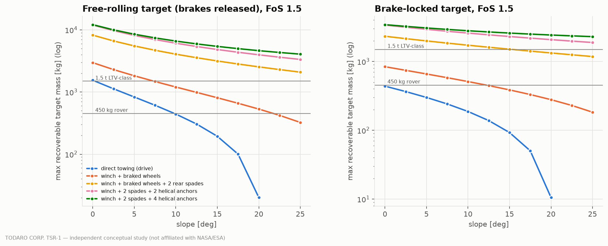

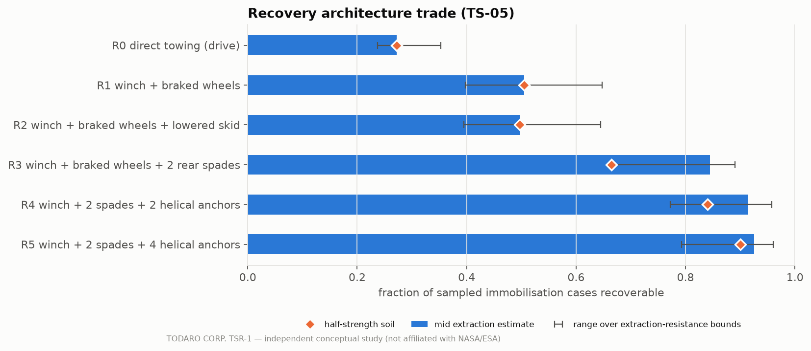

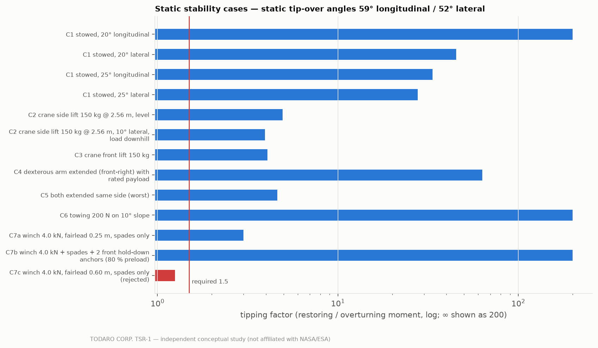

## 13. Power

**Architecture.** A regulated 120 VDC primary bus compliant with ISPSIS [@S011] with a 28 VDC avionics bus; a Li-ion
battery of passively propagation-resistant 18650 cells (pack 150–170 Wh/kg, [@S070]); two fixed vertical solar panels
(1.5 m² in total, one face lit at a time) for contingency charging and indefinite survival in sunlight; charging from
base nodes; and an isolated bidirectional **power-transfer module (PTM)**, 3 kW continuous / 4.5 kW for 60 s, with a 25 m
tether and a dust-tolerant connector [@S042], which delivers emergency power to client assets (hypothesis C). Because
120 VDC exchange is limited to short distances [@S012], the PTM connects at the asset rather than through the grid.

**Battery.** 23.6 kWh nameplate (28s67p, 101 V nominal, boost-regulated
to the 120 VDC bus by the PCDU),
**15 kWh usable at end of life** (depth of discharge 0.8, 20 % fade), 148 kg. The pack is
sized by DRM-2 at the 10 km service edge without solar credit plus a 50 h survival reserve (4.09 kWh).
The pre-review 14 kWh pack failed this check after a survival-heater double count was corrected (CDR-06).

**Mode power budget** (`engineering/power_budget.csv`; component loads summed per mode; the bus load excludes power
transferred to client assets, whose conversion losses appear in the electronics-box dissipation):

| Mode | Description | Bus load [W] | Electronics-box dissipation [W] |
|---|---|---|---|
| M1 | dormant | 60 | 26 |
| M2 | comm standby | 75 | 50 |
| M3 | driving | 471 | 181 |
| M4 | inspection | 242 | 165 |
| M5 | manipulation | 391 | 202 |
| M6 | heavy manip | 301 | 167 |
| M7 | recovery winch | 365 | 152 |
| M8 | emergency power | 110 | 350 |
| M9 | charging | 74 | 80 |
| M10 | survival | 82 | 26 |
| M11 | safe | 136 | 110 |

**Design reference missions** at the 10 km service edge (`src/tsr1/budgets/scenarios.py`):

| DRM | Title | Duration [h] | Distance [km] | Energy [kWh] | With PV [kWh] | Peak [W] |
|---|---|---|---|---|---|---|
| DRM-1 | Routine inspection patrol | 20.4 | 20.0 | 7.42 | 5.73 | 402 |
| DRM-2 | Electrical failure: emergency power + ORU replacement | 22.9 | 20.0 | 10.05 | 8.15 | 707 |
| DRM-3 | Dust contamination of solar array / radiator | 11.9 | 10.0 | 4.61 | 3.62 | 402 |
| DRM-4 | Immobilized rover recovery (450 kg, 10° slope) | 20.3 | 16.2 | 7.89 | 6.21 | 602 |
| DRM-5 | Communication node electronics replacement | 19.9 | 20.0 | 8.11 | 6.46 | 512 |
| DRM-6 | Heavy ORU exchange (100 kg battery module of a power node) | 9.1 | 6.0 | 3.23 | 2.48 | 402 |

Energy is dominated by hotel loads during slow autonomous traverse, so the service radius scales with effective speed
(Section 24). Battery size versus service radius:

| Radius [km] | DRM-2 energy [kWh] | Usable EOL required [kWh] | Pack mass [kg] |
|---|---|---|---|
| 5.0 | 6.86 | 10.95 | 108 |
| 7.5 | 8.45 | 12.54 | 123 |
| 10.0 | 10.05 | 14.14 | 139 |
| 12.5 | 11.65 | 15.74 | 154 |
| 15.0 | 13.24 | 17.34 | 170 |
| 20.0 | 16.44 | 20.53 | 201 |
| 25.0 | 19.63 | 23.72 | 234 |

**Emergency power.** At the 10 km edge, after reserving return energy and the survival reserve, TSR-1 can supply
10.6 h at 300 W keep-alive or 1.4 h at 3 kW. Longer support
uses deployable **MOD-KA keep-alive modules** left at the asset. The review found the original 23 kg, 2 kWh module
physically inconsistent (CDR-20) and resized it (trade TS-07b):

| Module option | Mass incl. MGA [kg] | Sustained output, nominal site [W] | Dark bridging at 100 W [h] | P(sustains a sampled asset) |
|---|---|---|---|---|
| KA-A 0.75 m² / 2 kWh | 39.3 | 113 | 19 | 0.40 |
| KA-B 1.0 m² / 3 kWh | 56.5 | 152 | 29 | 0.57 |
| KA-C 1.5 m² / 4 kWh | 72.6 | 231 | 38 | 0.76 |
| KA-D 1.5 m² / 6 kWh | 100.0 | 231 | 57 | 0.83 |

The selected **KA-C 1.5 m² / 4 kWh** module (73 kg, double spine slot) sustains a sampled parked asset
(survival power 40–250 W, site illumination 0.5–0.92, dark periods 24–120 h; assumptions A-33..A-35) with probability
0.76.

**Trade TS-06 (energy architecture):**

| Option | Added mass [kg] | Survival in darkness [h] | Indefinite in sun | TRL | Issue / decision |
|---|---|---|---|---|---|
| E1 Li-ion battery only, grid charging at nodes | 0 | 183 | no | 6 | stranded TSR in darkness dies after battery exhaustion |
| E2 Li-ion battery + fixed vertical solar arrays (1.5 m²) | 6 | 183 | yes | 7 | **selected** |
| E3 battery + MMRTG-class radioisotope power | 45 | ∞ | yes | 9 | Pu-238 supply and launch approval; ~2 kW waste heat helps PSR ops; not available to an independent commercial programme with confidence |
| E4 battery + regenerative fuel cell | 39 | 244 | no | 4 | mobile H2/O2 storage, cryo/pressure hazards near crew, low TRL on surface |
| E5 battery + wireless/beamed power | 8 | 183 | no | 3 | requires transmitter infrastructure and line of sight; low TRL |

Radioisotope power would give indefinite operation in permanently shadowed regions but was rejected for availability
and approval reasons for an independent programme; it is the recommended variant for a PSR-specialist mission.

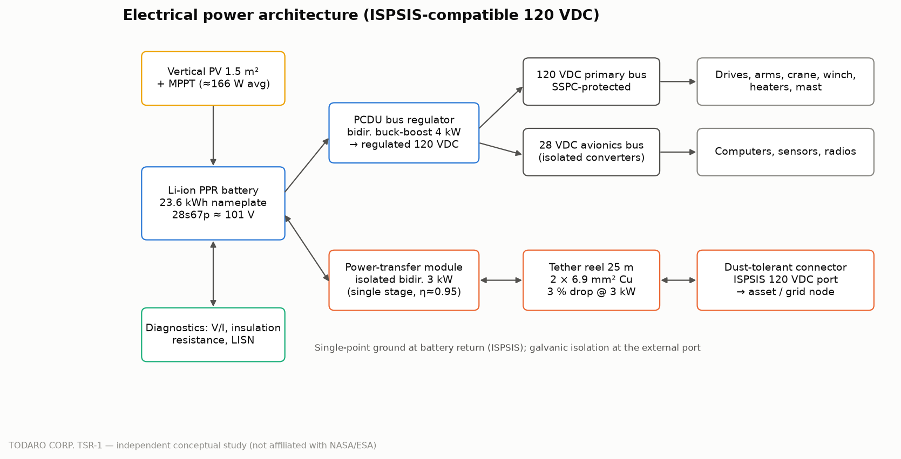

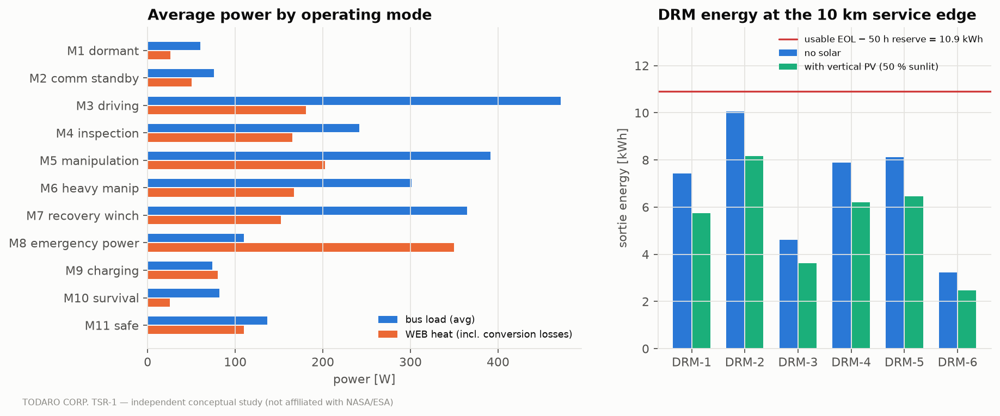

## 14. Thermal Control

The warm electronics box (WEB, 1.0 × 0.8 × 0.35 m) inside the chassis carries battery, power conditioning, PTM,
computers and radios under MLI (effective emittance 0.03, [@L006]). Heat is rejected by a zenith-facing radiator with
optical solar reflectors and an electrodynamic dust-shield film, coupled by a loop heat pipe with a thermal switch
(`src/tsr1/thermal/lumped.py`). At the pole the Sun stays within a few degrees of the horizon, so a zenith radiator
sees mostly cold sky; it is sized with a dusty absorptance (×2.0 of beginning-of-life, within the 1.4–2.6 range of
[@S062]).

* Radiator **1.64 m²** for 380 W at 293 K; maximum steady WEB dissipation over all modes
  **350 W**. The 3 kW power-transfer case is energy-limited
  (1.4 h at the 10 km edge, a few hours from a full battery) and its excess
  dissipation is absorbed by the WEB heat capacity within ΔT ≤ 15 K (closure THERMAL-1a/b). The PTM was moved to a
  single isolated stage on the battery after the first thermal closure failed.
* Cold case (PSR sink 40 K): leak 82 W, heaters 63 W after crediting electronics
  dissipation; survival power 82 W, giving **183 h** of darkness
  survival on a full battery and indefinite survival in sunlight (PV average 166 W > survival power).
* PSR excursions are limited to 8 h (energy-limited 19 h with a
  factor-two margin).
* Actuators are specified cold-tolerant (no survival heat), following the bulk-metallic-glass gear demonstration
  [@S040]; heritage-class actuators would need warm-up heaters [@S041] and would cut darkness survival by roughly
  80 h (technology gap TG-01).

## 15. Avionics and Autonomy

**Computing.** Two physically separate domains. The autonomy domain runs on a High-Performance Spaceflight Computing
class processor (rad-hard variant 100 krad TID, [@S039]) and hosts the mission and task planners, verified skill
sequencer, perception and motion planning; machine-learning components (terrain classification, anomaly ranking,
pose estimation, diagnosis ranking) are advisory. The safety/real-time domain is a dual-lane radiation-hardened
computer pair running servo loops, force/impedance control and the winch tension loop, and independent deterministic
guards (force/torque, speed near crew 0.2 m/s and 50 N, tip factor from measured centre of pressure, winch tension,
power-port interlocks, keep-out zones). **The autonomy domain never commands actuator torques directly**: it requests
skills, and the safety domain executes only those that pass its checks; it can also execute pre-verified skills and
minimal navigation alone (degraded mode DM-7).

**Trade TS-09 (autonomy).** Duration of a module swap and human operator time by control concept:

| Option | Task duration [h] | Operator time [h] | Works in comm outage | Contact safety |
|---|---|---|---|---|
| AU1 Earth joystick teleoperation | 5.4 | 5.4 | no | poor: force loops through 8 s latency |
| AU2 local crew teleoperation (crew present only) | 2.1 | 2.1 | yes | good |
| AU3 supervised autonomy: verified skills + hold-point approvals (selected) | 3.3 | 0.8 | yes | good: local F/T loops, deterministic guards |
| AU4 full autonomy (no human approval) | 2.0 | 0.0 | yes | unverifiable for novel faults |

Teleoperation from Earth is slow because of the round-trip delay and ≈ 51 % direct-to-Earth availability [@S073] and
unsafe for contact tasks because force loops would close through seconds of latency. Full autonomy cannot be
verified for novel faults. **Selected: supervised autonomy** with human approval at hold points (power connection,
release of load-bearing fasteners, ORU insertion, winch tension above 1 kN). Multi-robot autonomy precedent comes from
CADRE [@S069].

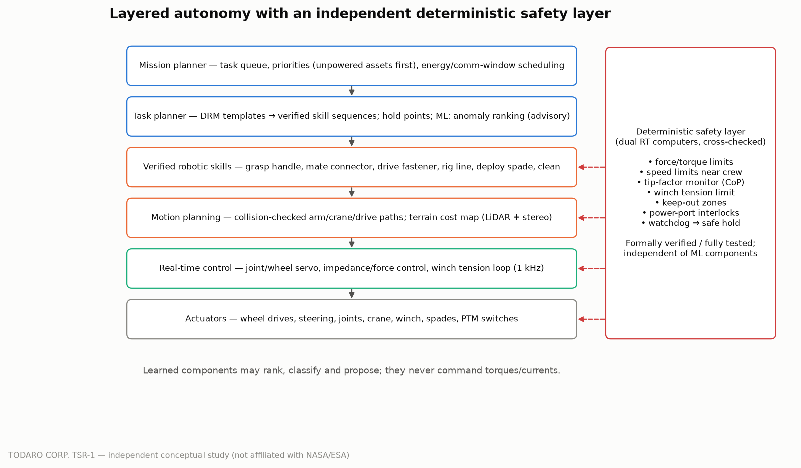

## 16. Communications and Navigation

**Trade TS-08.** Link availability by architecture (component availabilities: surface network 0.90 within the base,
relay 0.80 in the early constellation, direct-to-Earth 0.51 [@S073]):

| Architecture | Availability |
|---|---|
| C1 DTE only | 0.510 |
| C2 relay only | 0.800 |
| C3 surface network only | 0.900 |
| C4 surface network + relay + mesh + DTN (selected) | 0.980 |
| C5 C4 + DTE backup | 0.990 |

**Selected:** the base surface network (LTE-class, with lunar precedent [@S068]; towers covering ≈ 10 km cells,
[@S054]), LunaNet-compatible S-band relay [@S017; @S018], a UHF peer mesh with assets and other robots, and
delay-tolerant networking for all non-real-time data [@L020]. Link budget:

| Case | EIRP [dBW] | Path loss [dB] | C/N0 [dB-Hz] | Max data rate |
|---|---|---|---|---|
| relay @ 10 000 km (S-band, 5 W, 10 dBi) | 17.0 | 179.5 | 63.1 | 407 kbit/s |
| relay @ 3 000 km | 17.0 | 169.0 | 73.6 | 4.5 Mbit/s |
| Ka-band option @ 10 000 km | 40.0 | 200.7 | 74.9 | 6.1 Mbit/s |

Approval-critical data for a hold point (≈ 50 MB of imagery and LiDAR) moves over the relay in 15–20 min in the worst
case; bulk data waits for the surface network. Ka-band was rejected (pointing mechanism in dust, power) because approval
latency rather than bandwidth limits productivity. A deployable repeater module extends links into shadowed craters.

**Navigation.** Visual odometry, an LN-200S-class IMU [@S065], sun sensor/star tracker and LiDAR map matching give
≤ 1 m global position in the base frame; before contact, relative pose is refined to ≤ 5 mm / 0.5° from fiducials and
stereo. LunaNet positioning services, when available, discipline the clock and global fix.

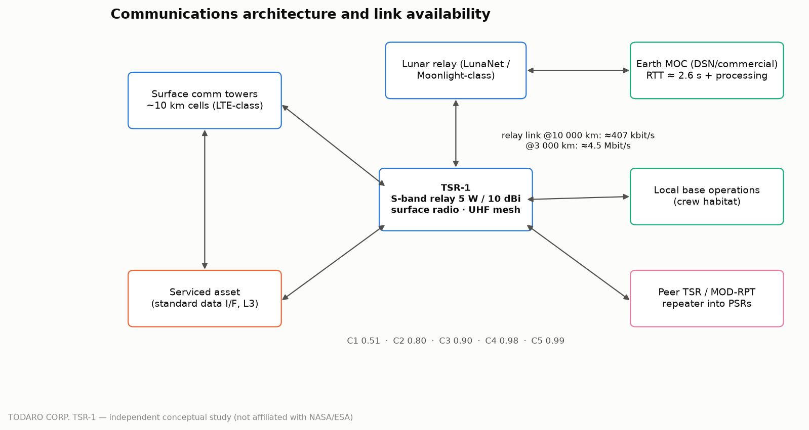

## 17. Dust Mitigation

Dust is treated as a design load, not an afterthought. Apollo experience lists vision obscuration, false readings,
coating, traction loss, clogging of mechanisms, abrasion, thermal-control degradation and seal failure, and shows that
losing a fender produces a "rooster tail" of ejecta [@S022]. TSR-1's measures follow those failure modes:

| Failure mode | Measure | Basis |
|---|---|---|
| Wheel ejecta onto radiator, optics, mechanisms | fenders with skirts over all six wheels | Apollo LRV fender loss [@S022] |
| Radiator absorptance growth | zenith radiator sized for α × 2.0; electrodynamic dust-shield film | [@S062; @S063; @S019] |
| Optics obscuration | EDS on camera and LiDAR windows; covers when idle | [@S063] |
| Mechanism clogging, torque rise | labyrinth seals + PTFE bellows on every external joint; no dynamic elastomers | [@S021] |
| Connector contamination | dust-tolerant connector with self-closing cover, pre-mate brushing and contact-resistance check | [@S042] |
| Client asset degradation | brush and EDS-wand tools; residual coverage target ≤ 5 % | MR-07 |

EDS energy is negligible (≈ 3.3 mWh/m² per cleaning cycle, [@S063]); the cost is kV electronics and patterned
transparent electrodes. Ten-year dust life of about thirty external actuators is an open technology gap (TG-07).

## 18. Materials

Material choices were made per component against strength, stiffness, thermal expansion over a 40–390 K range,
abrasion, cold toughness and heritage, using handbook properties [@L005] (`engineering/materials_matrix.csv`,
40 rows). **Trade TS-10** compared candidates for the two structures where the choice matters most:

*Dexterous-arm links:*

| Material | Arm mass [kg] | Specific stiffness [MN·m/kg] | CTE [10⁻⁶/K] | Growth over 1.5 m, 250 K [mm] |
|---|---|---|---|---|
| CFRP high-modulus tube | 25.4 | 75.0 | 0.5 | 0.19 |
| Al 7075-T7351 tube | 26.9 | 25.5 | 23.4 | 8.78 |
| Ti-6Al-4V tube | 27.8 | 25.7 | 8.6 | 3.23 |

*Chassis torque box:*

| Material | Chassis mass [kg] | Face thickness [mm] | f₁ [Hz] | CTE [10⁻⁶/K] |
|---|---|---|---|---|
| Al 7075-T7351 | 65.3 | 1.00 | 46 | 23.4 |
| Al 2219-T87 | 65.7 | 1.00 | 46 | 22.3 |
| Al-Li 2195-T8 | 64.0 | 1.00 | 47 | 21.6 |
| Ti-6Al-4V | 86.7 | 1.00 | 58 | 8.6 |
| CFRP quasi-iso (M55J/cyanate) | 50.0 | 1.00 | 57 | 0.5 |

The chassis is minimum-gauge driven, so the lighter options save little; aluminium honeycomb (Al 7075 faces, Al 5056
core) was selected for manufacturability, damage tolerance and repairability, with CFRP kept as a −15 kg descope.
Titanium arm links were selected over aluminium for their thermal-expansion match to steel gear sets and the lower
thermal growth that the 2 mm positioning requirement needs. Wheels and hard points are Ti-6Al-4V; the crane boom and
mast are CFRP; the recovery line is Vectran, which is about one fifth of the mass of an equivalent steel rope.

## 19. Mass and Power Budgets

**Mass.** The bottom-up budget (`engineering/mass_budget.csv`) lists every component with current best estimate
(CBE), AIAA S-120A growth allowance by category and maturity [@S052], position, material, TRL and the model or source that
gives its mass. A 15 % system margin is added to the predicted mass to form the dry allocation, and a 5 % lander
accommodation allowance to form the delivered mass.

| Subsystem | CBE [kg] | Predicted (CBE + MGA) [kg] | Growth |
|---|---|---|---|
| avionics | 24.5 | 30.6 | 25 % |
| communications | 6.7 | 8.4 | 25 % |
| dust | 14.0 | 17.1 | 22 % |
| harness | 46.0 | 73.6 | 60 % |
| manipulation | 73.8 | 92.3 | 25 % |
| mobility | 211.3 | 261.1 | 24 % |
| power | 193.2 | 219.2 | 13 % |
| recovery | 50.3 | 62.6 | 25 % |
| sensors | 17.2 | 21.6 | 25 % |
| service_spine | 14.6 | 17.5 | 20 % |
| stabilisation | 9.4 | 11.3 | 20 % |
| structure | 97.2 | 116.6 | 20 % |
| thermal | 20.6 | 25.8 | 25 % |
| tools | 33.5 | 41.9 | 25 % |

CBE 812 kg → predicted 1,000 kg → dry allocation 1,150 kg → operational
1,250 kg (with 100 kg of carried ORUs and modules) → **delivered 1,207 kg**. A Monte Carlo over
the mass-estimating relations and growth allowances gives P10/P50/P90 = 1,153/1,246/1,374 kg and
P(delivered ≤ 1.5 t) = 0.99: TSR-1 fits an Argonaut-class 1.5 t lander with margin [@S047] and a Blue Moon
Mk1-class 3 t lander easily [@S056], but not a Griffin-class lander [@S057].

**Power.** Mode powers are sums of component loads (Section 13); peak simultaneous load is 3,402 W
against a 4 kW PCDU.

**Closure.** 46 independent checks (directive §44) all pass after the design review:

| Check family | Passed |
|---|---|
| MASS | 5/5 |
| POWER | 3/3 |
| ENERGY | 3/3 |
| THERMAL | 3/3 |
| MOB | 3/3 |
| REC | 8/8 |
| MAN | 1/1 |
| STAB | 6/6 |
| GEOM | 8/8 |
| MISSION | 6/6 |

Selected checks:

| Check | Computed | Limit | Result |
|---|---|---|---|
| MASS-3 delivered mass ≤ 1.5 t (goal, Argonaut-class) | 1,207.00 | 1,500.00 | pass |
| ENERGY-1 worst DRM (DRM-2) + 50 h reserve ≤ usable EOL (no solar) | 14.14 | 15.00 | pass |
| ENERGY-2 full-battery survival ≥ 120 h (longest darkness at best sites, S030) | 183.30 | 120.00 | pass |
| THERMAL-1a max steady WEB dissipation (M9_charging) ≤ radiator design load | 319.92 | 380.00 | pass |
| MOB-1 ground pressure ≤ 7 kPa | 6.80 | 7.00 | pass |
| MOB-2 traction supports claimed 20° climb at ≤ 40 % slip | feasible | — | pass |
| REC-W winch rating ≥ max claimed line tension | 1,186.69 | 4,000.00 | pass |
| MAN-1 dexterous shoulder rating ≥ payload moment × MF | 150.34 | 196.50 | pass |
| GEOM-2 stowed length ≤ envelope | 3.60 | 4.00 | pass |

Two checks failed during the work and drove design changes rather than being relaxed: thermal closure (THERMAL-1)
failed during design iteration with a two-stage PTM, which was replaced by a single isolated stage on the battery,
and energy closure (ENERGY-1) failed in the pre-review snapshot (14.11 kWh needed against
14 kWh), which raised the battery to 15 kWh (CDR-06).

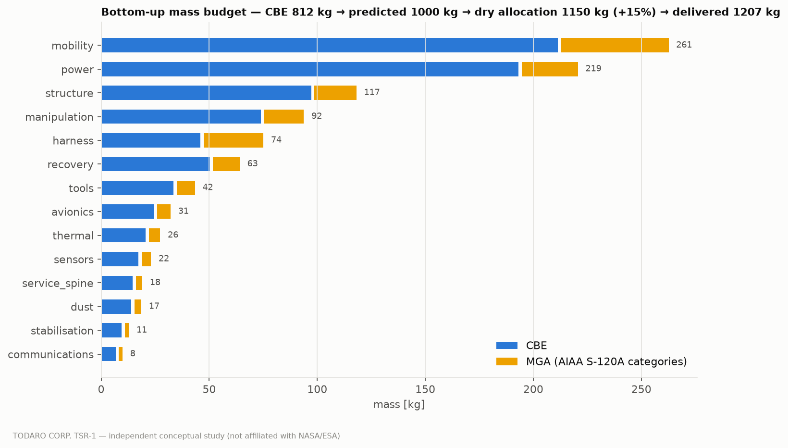

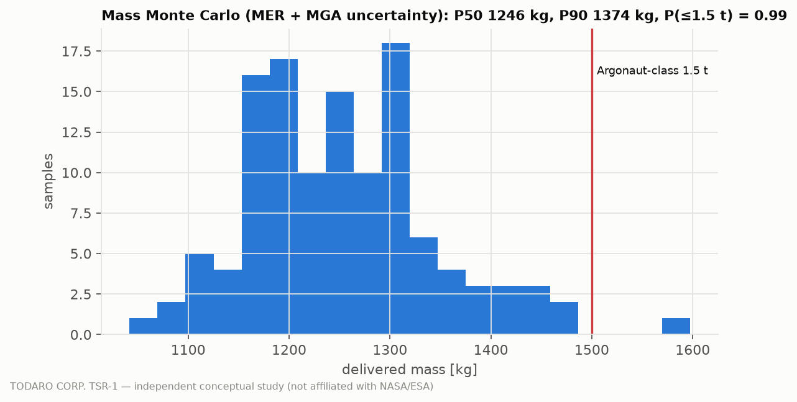

## 20. Reliability

TSR-1 itself is modelled as a set of orbital-replacement-unit classes with constant failure rates (ESTIMATE, by class:
drive units, steering units, arms, crane, winch, PTM, converters, computers, cameras, LiDAR, comm link, thermal loop,
battery modules), each classed as servicing-critical or not, and repaired by ORU replacement from spares
(`src/tsr1/reliability/tsr_reliability.py`). Exponential failures are assumed [@L019]; common-cause dust failures are
not modelled and would make these results optimistic.

| Repair policy | Faults per year | P(servicing-capable at 10 yr) | Fully functional fraction | Servicing-capable fraction | Mean outage [d] |
|---|---|---|---|---|---|
| crew repair | 1.26 | 0.99 | 0.41 | 0.997 | 298 |
| slow repair | 1.25 | 0.98 | 0.32 | 0.994 | 379 |
| peer | 1.26 | 0.99 | 0.44 | 0.997 | 280 |
| no repair | 1.03 | 0.59 | 0.08 | 0.842 | 1,965 |

Repairability matters more than redundancy: with ORU repair by crew or a peer vehicle the rover remains
servicing-capable over ten years with high probability, without repair it does not. The FMEA (`engineering/fmea.md`)
lists 27 failure modes, the single-point failures that remain (winch, PTM, crane slew) and nine degraded modes
(DM-1..DM-9), e.g. driving on four of six wheels (13.4° slope) or providing PV-only
charging without the PTM.

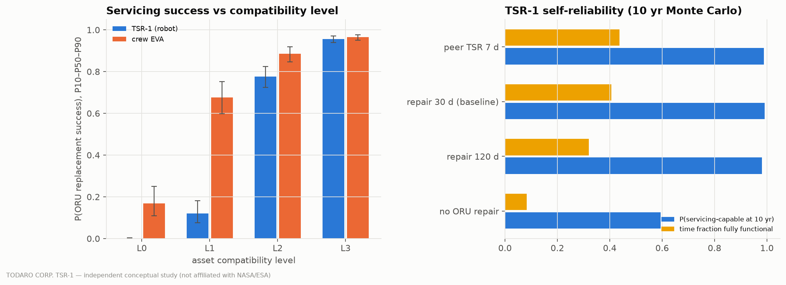

## 21. Infrastructure Availability Model

**Model.** A discrete-event simulation of a base of N assets over 10 years, run with and without TSR-1 on
common random numbers (`src/tsr1/reliability/value_model.py`). Assets are fixed or mobile (25 % mobile),
spread uniformly over a 10 km service radius, and of interface level L0–L3 (baseline mix
L0 20 %, L1 30 %, L2 35 %, L3 15 %). Faults arrive with a per-asset
MTBF (log-uniform 1–10 yr, A-08) and are of five types: electrical, dust, communication, immobilisation (mobile assets
only) and non-serviceable. A fraction of electrical/communication faults removes the asset's keep-alive power, and
the asset dies if not powered within its survival time (24–120 h). Without TSR-1, faults wait for a crew window
(zero to two 30-day missions per year with a crew-hour budget) or an Earth spare; lost assets are replaced from Earth
after 1–2 years. With TSR-1, a priority queue dispatches the rover (unpowered faults first); it travels at the
effective speed, restores power, attempts the repair with level-dependent success (Section 11), recovers immobilised
vehicles within the recovery envelope (Section 12), and, if a repair fails, leaves a keep-alive module so the asset
can wait for a spare or crew. TSR-1 itself fails and is repaired. Uncertain inputs (MTBF, spare availability,
survival time, lead times, crew missions, speed, TSR-1 reliability, keep-alive success) are sampled per replicate.

Two accounting rules came out of the design review (CDR-19). First, a failed TSR-1 attempt does not end the asset's
chances: crew can still act within the survival or abandonment time, as in the baseline. Second, losses from
non-serviceable faults are not preventable and grow with operating exposure — an asset that TSR-1 keeps alive can fail
again — so **preventable losses** and **Earth mass per available asset-year** are the fair comparison; totals are
reported alongside.

All value studies reuse the same seed, so replicate k draws the same epistemic scenario in every table (common random
numbers): rows of different tables are paired. The Monte Carlo standard error of a mean availability gain is
≈ 0.25 pp for the 400-replicate reference run and ≈ 0.35 pp for the 200-replicate sub-studies;
differences smaller than that are not resolved.

**Reference base (N = 30, 4 keep-alive modules, 400 epistemic Monte Carlo replicates):**

| Metric | Without TSR-1 | With TSR-1 | Difference |
|---|---|---|---|
| Mean availability | 0.685 | 0.763 | 1.8 / 7.0 / 14.5 pp |
| Preventable asset losses | 21.7 | 8.9 | -12.8 |
| Asset losses, all causes | 31.6 | 21.3 | -10.3 |
| Fault events | 65 | 81 | more uptime → more faults |
| Earth-supplied mass [t] | 13.0 | 9.5 | -3.5 |
| Earth mass per available asset-year [kg] | 70 | 46 | -24 |
| Crew EVA [crew-h] | 786 | 697 | -90 |
| TSR-1 response time P50 / mean [h] | — | 9.0 / 26.8 | mean includes TSR-1 downtime |
| TSR-1 utilisation | — | 1.5 % | — |

**Scale (keep-alive inventory sized per base by the CDR-19 rule; net = Earth mass avoided − TSR-1 life-cycle mass, which
includes the rover, ten years of spares and the keep-alive modules):**

| Assets | MOD-KA | ΔA mean [pp] | ΔA P10 [pp] | Preventable losses without | with | Mass avoided [t] | Net benefit [t] | kg per available asset-year, without → with | EVA avoided [crew-h] |
|---|---|---|---|---|---|---|---|---|---|
| 3 | 1 | 6.2 | -3.9 | 2.1 | 0.9 | 0.41 | -1.02 | 63 → 40 | 9 |
| 5 | 1 | 7.9 | -1.5 | 3.5 | 1.5 | 0.62 | -0.81 | 63 → 41 | 26 |
| 10 | 2 | 7.9 | 0.5 | 7.0 | 2.9 | 1.31 | -0.20 | 61 → 38 | 54 |
| 15 | 2 | 7.3 | 0.9 | 10.6 | 4.3 | 1.89 | 0.39 | 60 → 39 | 55 |
| 20 | 3 | 7.6 | 1.3 | 13.9 | 5.6 | 2.45 | 0.88 | 61 → 39 | 86 |
| 30 | 4 | 7.9 | 1.7 | 20.3 | 8.4 | 3.41 | 1.76 | 59 → 39 | 102 |
| 45 | 5 | 8.5 | 2.5 | 29.1 | 12.3 | 4.34 | 2.62 | 57 → 38 | 90 |
| 60 | 6 | 9.2 | 3.1 | 37.2 | 16.5 | 5.01 | 3.22 | 56 → 38 | 114 |

The logistics break-even is **≈ 12 assets**: the net benefit is negative for
3, 5, 10 assets, and the P10 of the availability gain is negative for 3, 5. Mass avoided grows
less than in proportion to base size (3.4 t at 30 assets, 5.0 t at 60), partly because a
base that TSR-1 keeps running accumulates more fault events; the mass per available asset-year (excluding TSR-1's own
life-cycle mass) is 32–37 % lower with TSR-1 at every base size.

**Asset standardisation** (same base, interface-level mix varied):

| Interface mix | ΔA [pp] | Preventable losses without | with |
|---|---|---|---|
| legacy (L0-heavy) | 2.9 | 19.1 | 11.4 |
| mixed (baseline) | 7.9 | 20.3 | 8.4 |
| standardised (L2/L3) | 13.3 | 20.9 | 5.6 |

**Crew presence:**

| Crew missions per year | ΔA [pp] | Preventable losses with TSR-1 | EVA with TSR-1 [crew-h] |
|---|---|---|---|
| 0 | 11.6 | 5.5 | 0 |
| 1 | 6.9 | 5.8 | 650 |
| 2 | 5.7 | 6.1 | 875 |

**Keep-alive inventory (reference base):**

| MOD-KA modules | Inventory mass [kg] | ΔA [pp] | Preventable losses | Earth mass with TSR-1 [t] | Requests with none free |
|---|---|---|---|---|---|
| 0 | 0 | 8.2 | 15.2 | 11.6 | 10.56 |
| 2 | 145 | 8.2 | 9.9 | 9.6 | 2.72 |
| 4 | 290 | 7.9 | 8.4 | 9.0 | 0.65 |
| 6 | 436 | 7.9 | 7.9 | 8.7 | 0.12 |
| 8 | 581 | 7.9 | 7.8 | 8.7 | 0.01 |

Keep-alive modules buy losses and logistics mass, not availability: a parked asset is still down while it waits. The
inventory rule — Poisson 95th percentile of f_park · p_KA · F · T_hold (Little's law) — gives 4 modules at
the reference base.

**Capacity study** (nominal scenarios with fixed MTBF; preventable losses over ten years; `simulations/capacity_study.py`):

| Assets / MTBF [yr] | Faults per year | Without TSR-1 | 1 TSR, 2 KA | 1 TSR, 4 KA | 1 TSR, 8 KA | 2 TSR, 4 KA | Response 1 TSR [h] | Response 2 TSR [h] | KA rule |
|---|---|---|---|---|---|---|---|---|---|
| 30 / 4 | 7.5 | 18.4 | 6.4 | 5.6 | 5.7 | 5.2 | 9.9 | 5.5 | 2 |
| 60 / 4 | 15.0 | 36.3 | 15.1 | 12.2 | 11.3 | 12.2 | 10.1 | 5.4 | 4 |
| 30 / 1.5 | 20.0 | 32.1 | 15.7 | 12.0 | 11.1 | 11.6 | 10.7 | 5.5 | 4 |
| 60 / 1.5 | 40.0 | 53.5 | 36.8 | 30.1 | 22.6 | 29.6 | 11.0 | 5.6 | 9 |
| 60 / 1 | 60.0 | 56.8 | 48.5 | 39.9 | 29.4 | 40.0 | 10.7 | 5.5 | 11 |

One TSR-1 does not saturate on driving or servicing time even at 60 faults per year (utilisation stays in the
single-digit percent range); what saturates is the keep-alive inventory. A second rover halves the response time but
barely changes losses, because response is already well inside the survival time.

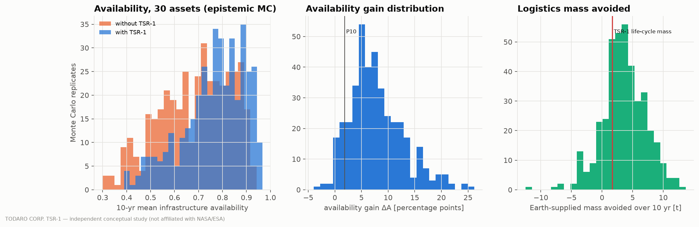

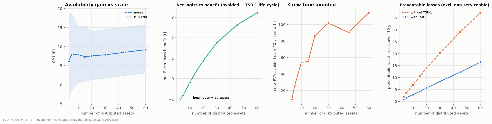

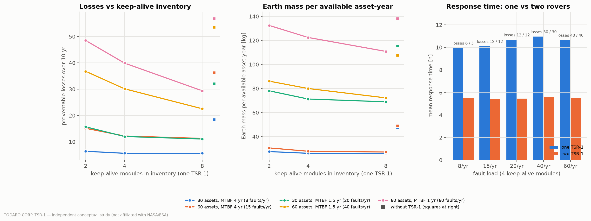

## 22. Trade Studies

The ten formal trades (`trade_studies/`) used direct engineering comparison — mass, capability, closure margin,
reliability — and weighted task coverage only where tasks have to be aggregated (TS-03, weights from DRM frequency).

| ID | Trade | Selected | Decisive reason |
|---|---|---|---|
| TS-01 | Mobility architecture | M2 six-wheel rocker-bogie + body lowering + differential lock | gradeability is soil-limited; +29 kg buys lowered work posture and wheel unloading |
| TS-02 | Wheels | rigid Ti Ø0.90 × 0.40 m, 18 × 20 mm grousers | ≤ 7 kPa at final mass; model confidence; dust |
| TS-03 | Manipulators | A7: two identical 7-DOF dexterous arms + cable-stayed crane | heavy arm ≈ 3.5× mass for little coverage |
| TS-04 | Stabilisation | body lowering + rear spades + front hold-down straps; no outriggers | outriggers resist tipping, not sliding |
| TS-05 | Recovery | R4: 4 kN winch, low fairlead, 2 spades + 2 helical anchors | towing traction-limited on slopes |
| TS-06 | Energy | Li-ion 15 kWh EOL + vertical PV + node charging | RPS rejected for availability/approval |
| TS-07 | Service modules | modular 6-slot spine; MOD-KA KA-C, inventory by rule | deployable keep-alive; host portability |
| TS-08 | Communications | surface network + LunaNet relay + UHF mesh + DTN | availability 0.98; latency not bandwidth limits |
| TS-09 | Autonomy | supervised autonomy with hold points | teleop slow and unsafe; full autonomy unverifiable |
| TS-10 | Structural materials | Al honeycomb chassis; Ti arm links, wheels, hard points; CFRP boom/mast | minimum-gauge chassis; CTE match |

**Adversarial review.** The team then acted as a hostile review board whose aim was to invalidate TSR-1
(`CRITICAL_DESIGN_REVIEW.md`):

| ID | Objection | Disposition |
|---|---|---|
| CDR-01 | Is a dedicated rover necessary? NASA's Lunar Utility Rover already includes servicing. | valid — kit variant added; dedicated carrier only where no host can respond in time |
| CDR-02 | Dual arms unjustified. | partially valid — heavy arm replaced by crane; second dexterous arm kept |
| CDR-03 | Too massive. | partially valid — descope list; kit variant |
| CDR-04 | Towing unrealistic in regolith. | valid — anchored winching |
| CDR-05 | Anchors impractical. | partially valid — accepted risk, TRL 3, proof-load hold point |
| CDR-06 | Battery inadequate. | valid — 14 → 15 kWh; radius tied to speed |
| CDR-07 | Spine adds mass. | invalid — saves carried mass; enables deployable modules |
| CDR-08 | Assets will not be standardised. | valid — open; dominant value driver |
| CDR-09 | Robotic repair too difficult. | partially valid — pessimism case keeps value positive |
| CDR-10 | Autonomy too complex. | partially valid — verified skills, deterministic guards |
| CDR-11 | Relies on non-existent infrastructure. | valid — open; degraded alternatives recorded |
| CDR-12 | Low utilisation. | valid — patrols and logistics in idle time (not credited) |
| CDR-13 | Effective speed optimistic. | valid — service radius tied to demonstrated speed |
| CDR-14 | Thin thermal margins with dust. | accepted — EDS, charging throttling |
| CDR-15 | Slope capability overstated. | valid — nominal and conservative requirement |
| CDR-16 | Launch loads unknown. | accepted — open until lander selection |
| CDR-17 | Value is an artefact of fault rate. | valid — scope: not justified for small bases |
| CDR-18 | A second TSR is needed. | accepted — one unit; capacity set by keep-alive inventory |
| CDR-19 | Value collapses at large bases. | partially valid — exposure artefact corrected; keep-alive inventory rule |
| CDR-20 | Keep-alive module cannot do what is claimed. | valid — module resized (23 → ≈ 73 kg) and its success probability modelled |
| CDR-21 | The equipment does not fit on the deck. | valid — single layout definition; spine as 2 × 3 grid mid-deck; arms stow upright; WEB moved aft to restore axle loads |

The review invalidated two original hypotheses (heavy service arm; towing as the primary recovery method), found
three physical inconsistencies in the pre-review design (battery energy; keep-alive module mass; deck layout), corrected one
modelling inconsistency (failed-attempt handling) and substantially weakened the case for a *dedicated* vehicle
relative to a host-mounted service-and-recovery kit (≈ 352 kg against
1,207 kg for the dedicated rover).

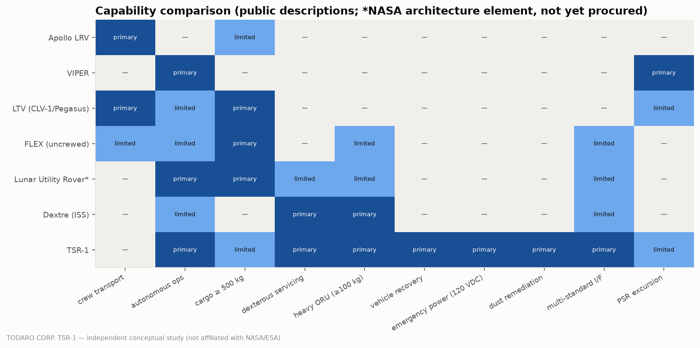

## 23. Simulation Results

Consolidated performance of the frozen configuration (`DESIGN_FREEZE_V1.md`, generated from the same results):

| Quantity | Value |
|---|---|
| Delivered / operational mass | 1,207 / 1,250 kg |
| Gradeability (slip ≤ 0.4) | 20.7° nominal, 15.6° conservative |
| Contact pressure | 6.64 kPa |
| Service radius / response time | 10 km / ≤ 10 h (radius scales with effective speed) |
| Range on one charge (keeping 50 h reserve) | 34 km |
| Darkness survival (full battery) | 183 h; indefinite in sunlight |
| Emergency power | 3 kW continuous, 4.5 kW for 60 s; 10.6 h at 300 W at the 10 km edge |
| Manipulation | 2 × 20 kg dexterous arms, reach 1.6 m; crane 150 kg at 2.56 m |
| Recovery | free-rolling vehicles up to 4.8 t and brake-locked vehicles up to 2.3 t on slopes ≤ 15° (anchored winch, FoS 1.5); 450 kg-class rovers with wheels embedded ≤ 0.15 m after ramp excavation; direct towing of free-rolling vehicles ≤ 1.5 t on level ground; P(sampled immobilisation case recoverable) = 0.92 |
| Recovery scenarios A–D3 | A ✓, B ✓, B2 ✓, C ✓, C-hi ✗, C-dig ✓, D ✓, D2 ✓, D3 ✓ |
| P(servicing-capable at 10 yr) | 0.99 |
| Budget closure | 46/46 checks pass |

Each design reference mission (Section 13) fits the battery's usable energy at the 10 km edge with the survival
reserve intact (worst case DRM-2, closure ENERGY-1) and completes within one 30 h approval cycle (closure MISSION
checks). The DRM-2 electrical-fault mission — traverse, inspect,
connect emergency power, diagnose, replace an ORU, test and return — takes 22.9 h and
10.05 kWh. The principal value results are those of Section 21: a mean availability gain of
7.8 percentage points at 30 assets, a reduction of preventable losses by
59 %, and an Earth-mass reduction of
27 %, with modest EVA savings.

## 24. Sensitivity Analysis

**Gradeability** is dominated by the soil friction angle φ (tornado, nominal 20.7°):

| Parameter | Range | Slope at low [°] | at high [°] | Swing [°] |
|---|---|---|---|---|
| soil friction angle φ [deg] | 30–46 | 16.4 | 30.7 | 14.3 |
| shear deformation modulus K [m] | 0.01–0.025 | 25.2 | 17.0 | 8.2 |
| cohesion c [Pa] | 100–1000 | 20.3 | 25.2 | 4.9 |
| sinkage exponent n | 0.8–1.2 | 18.8 | 21.1 | 2.3 |

**Delivered mass** is dominated by actuator torque density, system margin and motorisation factor (nominal
1,207 kg):

| Parameter | Range | Mass at low [kg] | at high [kg] | Swing [kg] |
|---|---|---|---|---|
| actuator torque density [N·m/kg] | 15–40 | 1,391 | 1,117 | 274 |
| system margin | 0.1–0.25 | 1,145 | 1,335 | 190 |
| motorisation factor | 1.5–3 | 1,167 | 1,291 | 124 |
| battery specific energy [Wh/kg] | 130–200 | 1,266 | 1,156 | 110 |
| mechanism growth allowance | 0.125–0.375 | 1,156 | 1,259 | 103 |

**DRM-2 energy** is dominated by the effective traverse speed (hotel loads during slow traverse), not by drive or conversion efficiency:

| Parameter | Range | Energy at low [kWh] | at high [kWh] | Swing [kWh] |
|---|---|---|---|---|
| effective traverse speed [km/h] | 0.7–2.5 | 15.16 | 6.88 | 8.28 |
| keep-alive power [W] | 100–500 | 9.10 | 11.00 | 1.89 |
| driving duty | 0.5–0.9 | 9.32 | 10.78 | 1.46 |
| drive efficiency | 0.55–0.8 | 10.71 | 9.75 | 0.96 |

| Effective speed [km/h] | Max service radius [km] | DRM-2 energy at 10 km [kWh] |
|---|---|---|
| 0.70 | 6.2 | 15.16 |
| 1.00 | 9.0 | 11.71 |
| 1.26 | 11.2 | 10.05 |
| 1.80 | 16.0 | 8.13 |
| 2.50 | 22.5 | 6.88 |

**Recovery** probability responds most to the recovery factor of safety, then the spade shape factor and
the helical-anchor breakout factor N_q*; the one-at-a-time swings are small because most sampled cases sit well inside the capacity,
whereas halving soil strength or taking the upper extraction-resistance bound moves it far more (Section 12:
0.84 and 0.77 against 0.92):

| Parameter | Range | P at low | at high | Swing |
|---|---|---|---|---|
| recovery factor of safety | 1.25–2 | 0.93 | 0.86 | 0.06 |
| spade shape factor | 1–1.8 | 0.90 | 0.93 | 0.03 |
| helical-anchor breakout factor N_q* | 10–40 | 0.90 | 0.93 | 0.03 |
| P(target brakes releasable) | 0.4–0.9 | 0.92 | 0.92 | 0.00 |

**Value.** Correlation of the sampled inputs with the availability gain and with Earth mass avoided (reference base):

| Input | corr. with ΔA | corr. with mass avoided |
|---|---|---|
| asset MTBF | -0.33 | -0.19 |
| spare availability | 0.14 | 0.04 |
| asset survival time | 0.04 | -0.08 |
| crew missions per year | -0.19 | 0.46 |
| TSR-1 effective speed | -0.00 | -0.02 |
| TSR-1 MTBF | 0.08 | 0.03 |
| fraction of faults removing power | -0.16 | 0.30 |

Higher asset MTBF (fewer faults) reduces the gain; more crew presence
reduces the availability gain but increases the
mass avoided (crew and TSR-1 together repair more assets than either alone). Pessimistic robot skill reduces the value
roughly in proportion to ORU-swap success but does not remove it; a shared host busy 30 % of the time with 24 h delays
performs like the dedicated rover (ΔA 7.8 vs 7.9 pp, a difference inside the Monte Carlo
scatter), while one busy 60 % of the time with 72 h delays loses 0.9 pp and raises preventable
losses from 8.4 to 12.6:

| Robot step factor | P(ORU swap, L2) | ΔA [pp] | Preventable losses |
|---|---|---|---|
| 0.90 | 0.44 | 3.9 | 10.1 |
| 0.95 | 0.60 | 6.1 | 9.1 |
| 1.00 | 0.78 | 7.9 | 8.4 |

| Host case | ΔA [pp] | Preventable losses |
|---|---|---|
| dedicated TSR-1 | 7.9 | 8.4 |
| kit on shared utility rover (busy 30 %, 24 h) | 7.8 | 8.9 |
| kit on shared utility rover (busy 60 %, 72 h) | 7.0 | 12.6 |

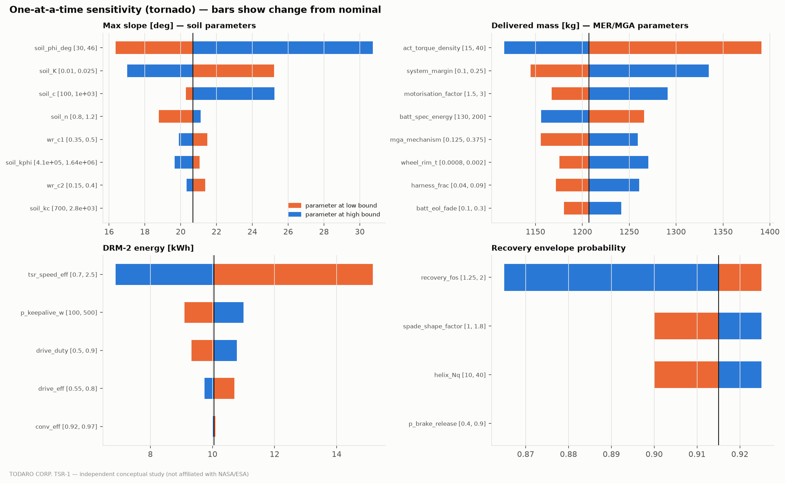

## 25. Technology Readiness

TRL is assessed for the TSR-1 application environment (lunar south pole, 40–390 K, abrasive and electrostatic dust,
ten-year life) using the NPR 7123.1 definitions [@S072], not for each technology's best heritage environment
(`research/technology_readiness.md`, 29 elements). Elements at TRL ≤ 4 or flagged as gaps:

| Element | TRL | Class |
|---|---|---|
| Cold-tolerant actuators (BMG gears, dry lube, heaterless) | 4 | P / **G** |
| Cable-stayed crane boom (LSMS-type) | 4 | P |
| Dust-tolerant power connector (3 kW, 120 VDC) | 4–5 | P / **G** |
| Supervised servicing autonomy (verified skills, hold points) | 4 | I / **G** |
| Regolith spades and helical anchors | 3 | **G** |
| Asset-side robotic servicing standards (L2/L3) | n/a | **G** (programmatic) |

The crane is TRL 4 but is not counted as a technology gap: ground prototypes exist [@S015] and no physical obstacle
was found. Component maturity reaches TRL 7 for structure, cameras, computers and navigation sensors, but the integrated
servicing-and-recovery system has never been built or tested in a relevant environment: **integrated TRL 4**. The
critical path runs through asset-interface standardisation (programmatic), servicing-autonomy verification,
regolith anchors, long-life cold and dust-tolerant mechanisms, and a robot-mateable kW connector.

## 26. Limitations

* **Evidence access.** Agency servers were blocked in the study environment; sources were read through
  search-engine excerpts (access labels in Section 29). Several handbook values are literature recall, not re-verified
  against full texts. One seed document could not be resolved.
* **No lunar failure data.** Asset fault rates, the fault-type mix and task-step success probabilities are
  assumptions with wide ranges (A-08, A-31). The value results are comparative, not predictive; conclusions rest on
  robust trends — sign, dependence on scale, dependence on standardisation — rather than absolute values.
* **Soil mechanics without lunar validation.** Terramechanics is calibrated on one datum (LRV energy) and anchors on
  none; slope claims carry several degrees of uncertainty and recovery claims are contingent on anchor tests.
* **Static and lumped models.** No vehicle dynamics, crane load-swing, transient thermal or finite-element analysis;
  arm and chassis masses carry ±30–40 %.
* **Keep-alive module.** Parked-asset survival power and dark-period statistics are assumed distributions
  (A-33..A-35); their real values decide how many losses the modules prevent.
* **No cost model.** Earth-supplied mass is used as the logistics proxy because no defensible cost data for lunar
  surface robotics were retrieved.
* **Scope.** Command authority over third-party assets, cybersecurity, lander accommodation and crew human factors
  beyond speed and force limits are not designed.

Full discussion: `docs/limitations.md`; open questions OQ-01..OQ-15: `results/open_questions.md`.

## 27. Development Roadmap

No calendar dates are given: there is no funded programme, selected lander or adopted asset-interface standard on
which to base a schedule (`docs/development_roadmap.md`). The stages are ordered by technical dependency:

| Stage | Content | Exit gate |
|---|---|---|
| 0 Digital modelling | this study | closure, design freeze, review dispositions |
| 1 Subsystem breadboards | anchor pull-out rig in simulants; single-wheel rig; 3 kW connector mating rig; cold actuator life rig; PTM breadboard; servicing skills on a commercial arm | anchor capacity within ±30 % of model or recalibrated; ≥ 500 robotic mates; actuator life ≥ 25 % of duty |
| 2 Earth prototype | full-scale 1-g rover with arms, crane, spine, winch, PTM | all DRMs end-to-end on L0–L3 analogue targets |
| 3 Analogue field testing | multi-week campaigns with delays, outages, polar lighting | measured task success, effective speed, operator hours |
| 4 Thermal-vacuum and dust | subsystem and system TVAC (40–390 K), charged-dust chamber | ≥ 120 h survival; 3 kW transfer within limits |
| 5 Reduced-gravity / qualification | parabolic-flight wheel and anchor tests; crane swing control; launch loads | lunar-g traction penalty and anchor capacity quantified |
| 6 Flight demonstrator | reduced TSR (one arm, PTM, recovery kit, keep-alive module) servicing cooperative L2/L3 demo assets | in-situ ORU swap, power rescue, anchored recovery |
| 7 Operational system | TSR-1 or kit on a utility-rover host for a base with standardised assets | measured availability gain |

Stage 1 anchor and actuator-life breadboards are the cheapest, highest-information tests and should come first;
Stage 6 should not start before asset owners agree on L2/L3 interfaces, because without them a demonstrator would
prove only inspection and emergency power.

## 28. Conclusions

1. **The engineering closes, with identified technology development.** A 1,207 kg rover performing
   inspection, 120 VDC emergency power, robotic ORU servicing, dust remediation and anchored-winch recovery passes all
   46 closure checks with components that are mostly TRL 5–7, but depends on four immature items: regolith
   anchors (TRL 3), cold- and dust-tolerant long-life actuators (TRL 4), verified supervised servicing autonomy
   (TRL 4) and robot-mateable dust-tolerant kW connectors (TRL 4–5). **Verdict: feasible with identified technology
   development** (`results/FEASIBILITY_VERDICT.md`).
2. **Two Todaro hypotheses failed in their original form.** A heavy service arm is mass-inefficient in lunar gravity
   (a crane does the lifting); towing is traction-limited on slopes (anchored winching raises recoverable cases from
   27 % to 92 %). Emergency power through
   standard interfaces (C), the modular spine (D) and multi-standard interfaces with levels L0–L3 (E) survived.
3. **The answer to the research question is a conditional yes.** For a 30-asset base, one TSR-1 raises mean
   availability by 7.8 percentage points (P10 1.8), cuts preventable losses by
   59 % and Earth-supplied mass by 27 %;
   it reduces crew EVA only modestly (786 → 697 crew-h), because assets it saves
   often still need crew for repairs it cannot do on non-standard interfaces.
4. **Scale and standards decide.** Below ≈ 12 serviceable assets TSR-1 does not pay for itself in
   logistics mass (-0.81 t at 5 assets). The availability gain is
   2.9 pp for a legacy base and 13.3 pp for a
   standardised one: an L2 robotic-service interface requirement on lunar assets is worth more than any improvement to
   the rover.
5. **Keep-alive power is the core function, and its inventory is the scaling lever.** Preventing thermal death of
   unpowered assets is where most of the value comes from; at large or failure-prone bases a single rover saturates
   on keep-alive modules, not on driving or servicing time.
6. **A host-mounted kit is preferable where a host can respond in time.** The servicing and recovery functions
   weigh ≈ 352 kg as a kit; a dedicated carrier is justified only where no utility-rover
   host can reach an unpowered asset within its survival time.

The goal of the study was not to make TSR-1 look possible but to find what it would have to be to be possible. The
answer is a modest, anchor-dependent, keep-alive-centred service-and-recovery capability whose value is set less by
its own engineering than by how the rest of the lunar base is designed.

## 29. References

Keys refer to `paper/references.bib` and `research/source_register.csv`. *Access* states how the source was consulted in this study: EXCERPT (search-engine excerpt attributed to the primary document), SECONDARY (reported by a secondary source), EXISTENCE-ONLY (existence and scope confirmed, content not used for numbers), LITERATURE-RECALL (standard handbook value, not re-verified against the full text), NOT-RETRIEVED.

- **[L001]** Wong J.Y. *Theory of Ground Vehicles, 4th ed*. textbook, 2008. Wiley, ISBN 978-0-470-17038-0. Access: LITERATURE-RECALL.
- **[L003]** Wong J.Y., Reece A.R. *Prediction of rigid wheel performance based on the analysis of soil-wheel stresses, Parts I-II*. peer-reviewed, 1967. J. Terramechanics 4(1):81-98; 4(2):7-25. Access: LITERATURE-RECALL.
- **[L004]** Janosi Z., Hanamoto B. *The analytical determination of drawbar pull as a function of slip for tracked vehicles in deformable soils*. conference (ISTVS), 1961. Proc. 1st Int. Conf. Mechanics of Soil-Vehicle Systems, Turin. Access: LITERATURE-RECALL.
- **[L005]** Battelle / FAA. *Metallic Materials Properties Development and Standardization (MMPDS)*. materials handbook, 2021 (MMPDS-16/17). MMPDS. Access: LITERATURE-RECALL.
- **[L006]** Gilmore D.G. (ed.). *Spacecraft Thermal Control Handbook, Vol. I, 2nd ed*. handbook, 2002. The Aerospace Press, ISBN 1-884989-11-X. Access: LITERATURE-RECALL.
- **[L016]** Vasavada A.R. et al. *Lunar equatorial surface temperatures and regolith properties from Diviner*. peer-reviewed, 2012. J. Geophys. Res. 117, E00H18. Access: LITERATURE-RECALL.
- **[L019]** Ebeling C.E. *An Introduction to Reliability and Maintainability Engineering*. textbook, 2010. Waveland Press, 2nd ed. Access: LITERATURE-RECALL.
- **[L020]** CCSDS. *CCSDS Proximity-1 Space Link Protocol; CCSDS Bundle Protocol (DTN)*. standards, 2013-2020. CCSDS 211.0-B; CCSDS 734.2-B. Access: LITERATURE-RECALL.
- **[S001]** NASA (TX-13 team); IEEE Aerospace Conf. *Surface Systems Capability Gaps for Enabling NASA's Sustainable Lunar Operations*. conference paper (NASA-authored), 2022. IEEE Xplore 9843600; NTRS 20220002618 (directive seed ID 20210022361 not independently resolved). Access: EXCERPT.
- **[S004]** NASA ESDMD. *2025 Moon to Mars Architecture Update*. NASA architecture document, 2025. nasa.gov/wp-content/uploads/2025/12/2025-architecture-update-for-publication.pdf. Access: EXCERPT.
- **[S005]** NASA Moon to Mars Architecture. *Lunar Logistics, Mobility, and Cargo (white paper)*. NASA white paper, 2025. nasa.gov/wp-content/uploads/2025/02/2025-ia-workshop-wp-lunar-logistics-and-mobility.pdf. Access: EXCERPT.
- **[S006]** NASA; Spaceflight Now; CNN; ABC. *NASA Ignition event / Moon Base plan*. agency announcement + news, 2026. spaceflightnow.com/2026/03/25/...; nasa.gov/reference/moonbase-about/. Access: SECONDARY.
- **[S007]** NASA. *NASA Provides Update on Moon Base Rovers, Landers, Missions*. NASA news release, 2026. nasa.gov/news-release/nasa-provides-update-on-moon-base-rovers-landers-missions/. Access: EXCERPT.
- **[S010]** NASA STMD. *2026 Civil Space Shortfalls; FY26 Shortfall Prioritization*. NASA technology prioritization, 2026. nasa.gov/wp-content/uploads/2026/03/2026-civil-space-shortfalls.pdf; .../2026/05/fy26-civil-space-shortfall-prioritization.pdf. Access: EXCERPT.
- **[S011]** ISS partner agencies (NASA, ESA, JAXA, CSA, Roscosmos). *International Space Power System Interoperability Standards (ISPSIS) Rev A*. interoperability standard, 2022. internationaldeepspacestandards.com/wp-content/uploads/2024/02/ISPSIS-RevA-20220727-2.pdf. Access: EXCERPT.
- **[S012]** Csank J. et al. (NASA GRC). *Electric Power on the Moon / Lunar surface power grid & UMIC*. NASA presentations / IAC paper, 2024-2025. NTRS 20250000763; 20240013588; 20240008802. Access: EXCERPT.
- **[S013]** ISS partner agencies. *International External Robotic Interface Interoperability Standards (IERIIS)*. interoperability standard, 2019. internationaldeepspacestandards.com/wp-content/uploads/2024/02/robotic_baseline_final_3-2019.pdf. Access: EXCERPT.
- **[S015]** NASA LaRC. *Lunar Surface Manipulation System (LSMS)*. NASA technology description, 2009-2015. technology.nasa.gov/patent/LAR-TOPS-73; NTRS 20100033143. Access: EXCERPT.
- **[S017]** NASA SCaN / GSFC. *LunaNet Interoperability Specification v4; Lunar Relay Services Requirements Document*. interoperability specification, 2022/2025. nasa.gov/wp-content/uploads/2025/08/lunanet-interoperability-specification-lnis-v4.pdf; .../lunar-relay-services-requirements-document-srd.pdf. Access: EXCERPT.
- **[S018]** ESA. *Moonlight programme*. ESA press release, 2024. esa.int/Newsroom/Press_Releases/ESA_launches_Moonlight_. Access: EXCERPT.
- **[S019]** NASA KSC. *NASA's Dust Shield Successfully Repels Lunar Regolith on Moon (EDS on Blue Ghost M1)*. NASA news, 2025. nasa.gov/image-article/nasas-dust-shield-successfully-repels-lunar-regolith-on-moon. Access: EXCERPT.
- **[S021]** NASA. *Lunar Dust Considerations for Vertical Solar Arrays*. NASA Technical Memorandum, 2024. NASA TM-20240003496. Access: EXCERPT.
- **[S022]** Gaier J.R. (NASA GRC). *The Effects of Lunar Dust on EVA Systems During the Apollo Missions*. NASA Technical Memorandum, 2005. NASA/TM-2005-213610; NTRS 20050160460. Access: EXCERPT.
- **[S023]** Carrier W.D. III, Olhoeft G.R., Mendell W. *Physical Properties of the Lunar Surface (Lunar Sourcebook ch. 9)*. handbook chapter, 1991. Heiken, Vaniman & French (eds.), Lunar Sourcebook, CUP; lpi.usra.edu/publications/books/lunar_sourcebook/pdf/Chapter09.pdf. Access: EXCERPT.
- **[S024]** Carrier W.D. III (Lunar Geotechnical Institute). *Lunar Soil Simulation and Trafficability Parameters*. technical note, n.d. lpi.usra.edu/lunar/surface/carrier_lunar_trafficability_param.pdf. Access: EXCERPT.
- **[S027]** NASA NSSDC. *The Apollo Lunar Roving Vehicle*. NASA reference page, n.d. nssdc.gsfc.nasa.gov/planetary/lunar/apollo_lrv.html. Access: EXCERPT.
- **[S029]** Asnani V., Delap D., Creager C. (NASA GRC). *The Development of Wheels for the Lunar Roving Vehicle*. NASA Technical Memorandum, 2009. NTRS 20100000019. Access: EXISTENCE-ONLY.
- **[S030]** Gläser P. et al. *Illumination conditions at the lunar south pole using high resolution DTMs from LOLA*. peer-reviewed, 2014. Icarus 243, 78-90, doi:10.1016/j.icarus.2014.08.013. Access: EXCERPT.
- **[S032]** Paige D.A. et al. *Diviner Lunar Radiometer observations of cold traps in the Moon's south polar region*. peer-reviewed, 2010. Science 330, 479-482. Access: EXCERPT.
- **[S033]** Zhang S. et al. *First measurements of the radiation dose on the lunar surface*. peer-reviewed, 2020. Science Advances 6, eaaz1334. Access: EXCERPT.
- **[S035]** NASA ARC. *VIPER mission overview; VIPER rover facts*. NASA presentations/pages, 2020-2025. NTRS 20205000864; science.nasa.gov/mission/viper/in-depth. Access: EXCERPT.
- **[S036]** NASA JSC. *Lunar Terrain Vehicle Services requirements (RFP/SRD summaries)*. NASA RFP summary + secondary, 2023. nasa.gov/news-release/nasa-pursues-lunar-terrain-vehicle-services-for-artemis-missions/. Access: SECONDARY.
- **[S037]** Astrolab (Venturi Astrolab). *FLEX rover services*. company page, 2024. astrolab.space/flex-services. Access: EXCERPT.
- **[S039]** Microchip; NASA (Powell, LPSC 2025). *PIC64-HPSC High-Performance Spaceflight Computing*. datasheet + NASA presentation, 2025-2026. microchip.com/en-us/products/microprocessors/64-bit-mpus/pic64-hpsc; NTRS 20250002070. Access: EXCERPT.
- **[S040]** NASA JPL; NASA Spinoff. *COLDArm / Bulk Metallic Glass gears*. NASA news/spinoff, 2022. jpl.nasa.gov/images/pia24567-...; spinoff.nasa.gov. Access: EXCERPT.
- **[S041]** Castrol; NASA JPL (MSL thermal papers). *Braycote 601EF; MSL actuator thermal limits*. datasheet + NASA, 2012-2021. lube-media.ambrit.com L118; NTRS 20150007807. Access: EXCERPT.
- **[S042]** Honeybee Robotics; NASA SBIR; NASA KSC. *Dust-tolerant connectors (Honeybee DTC; Yank Technologies SBIR; KSC patent)*. LSIC presentation; news; patent, 2010-2025. lsic.jhuapl.edu/.../2532-2024-06-26 LSIC Surface Power Honeybee Robotics DTC.pdf; US 8,011,941. Access: EXCERPT.
- **[S043]** Kobayashi T. et al.; Wong J.Y. *Reduced-gravity rigid-wheel mobility (Kobayashi 2010) and prediction method (Wong 2012)*. peer-reviewed, 2010/2012. J. Terramechanics 47, 261-274; J. Terramechanics 49, 49-61. Access: EXCERPT.
- **[S044]** Moreland S. et al. (CMU/NASA GRC). *Soil behavior of wheels with grousers for planetary rovers (reduced-gravity test)*. conference (IEEE Aerospace), 2012. ri.cmu.edu/pub_files/2012/3/2012_IEEE_Aero_Moreland_REVb.pdf. Access: EXCERPT.
- **[S045]** NASA JPL; ASCE J. Aerospace Eng. *Axel/DuAxel tethered rovers; Dynamic anchoring in soft regolith*. NASA + peer-reviewed, 2013-2018. robotics.jpl.nasa.gov/how-we-do-it/systems/the-axel-rover/; doi:10.1061/(ASCE)AS.1943-5525.0000792. Access: EXCERPT.
- **[S046]** NASA JPL; news. *MER Spirit embedding (Troy 2009) and Opportunity Purgatory (2005)*. mission history (secondary), 2005-2009. universetoday.com; sciencenews.org. Access: SECONDARY.
- **[S047]** ESA. *Argonaut lunar lander*. ESA multimedia/press, 2025-2026. esa.int/ESA_Multimedia/Images/2025/11/Argonaut_lunar_lander. Access: EXCERPT.
- **[S048]** Space Applications Services. *HOTDOCK standard robotic interface*. product sheet + IAC paper, 2019-2024. spaceapplications.com/wp-content/uploads/2019/05/Product-Sheet_-HOTDOCK.pdf; IAC-20 60218. Access: EXCERPT.
- **[S049]** NASA. *On-Orbit Maintenance Operations Strategy for the ISS; NASA-STD-3001 TB Design for Maintainability*. NASA report + technical brief, 2010/2023. NTRS 20100042525; nasa.gov/.../ochmo-tb-036-design-for-maintainability.pdf. Access: EXCERPT.
- **[S051]** NASA. *Uncrewed Lunar Surface Operations and Support Activities*. NASA paper, 2022. NTRS 20220013667. Access: EXCERPT.
- **[S052]** AIAA. *ANSI/AIAA S-120A-2015 Mass Properties Control for Space Systems*. standard, 2015. ANSI/AIAA S-120A-2015. Access: EXCERPT.
- **[S054]** NASA; Astronomy.com. *Moon Base Phases; Moon Base Systems; Lunar Surface Technology pages*. NASA pages + secondary, 2026. nasa.gov/moonbase-phases/; nasa.gov/moonbase-systems/; nasa.gov/lunar-surface-technology/. Access: SECONDARY.
- **[S055]** NASA; NASASpaceflight; The Register. *LTV Phase 1 awards details*. NASA + secondary, 2026. nasaspaceflight.com/2026/05/rovers-drones-nasa-moon-base/. Access: SECONDARY.
- **[S056]** Blue Origin (reported). *Blue Moon Mk1 cargo lander*. company/secondary, 2025-2026. space.skyrocket.de/doc_sdat/blue-moon.htm. Access: SECONDARY.
- **[S057]** Astrobotic; Astrolab. *Griffin lander; FLIP rover*. company/secondary, 2025-2026. astrobotic.com; space.com Griffin-1 article. Access: SECONDARY.
- **[S058]** JAXA/Toyota; GITAI. *Lunar Cruiser pressurized rover; GITAI arm*. company/secondary, 2020-2026. gitai.tech/?p=8981; press. Access: SECONDARY.
- **[S060]** NASA (Apollo Lunar Surface Journal). *Apollo LRV energy consumption (ALSJ Apollo 17 close-out; NSSDC)*. NASA mission record, 1972/web. nasa.gov/wp-content/uploads/static/history/alsj/a17/a17.clsout3.html. Access: EXCERPT.
- **[S061]** (authors per arXiv:2511.04740). *Micrometeoroid Impact Rate Analysis for an Artemis-Era Lunar Base*. preprint (MEM 3 based), 2025. arXiv:2511.04740. Access: EXCERPT.
- **[S062]** Gaier J.R. et al. (NASA GRC); TFAWS 2024 PT-4. *Dusted thermal control surfaces: absorptance/emittance change*. NASA report + conference, 2011/2024. NTRS 20110013486; tfaws.nasa.gov/wp-content/uploads/TFAWS2024-PT-4-Paper.pdf. Access: EXCERPT.
- **[S063]** Calle C.I. et al. (NASA KSC). *Electrodynamic Dust Shield technology papers*. NASA reports, 2012-2020. NTRS 20120003264; 20200000920. Access: EXCERPT.
- **[S065]** Northrop Grumman. *LN-200S Inertial Measurement Unit datasheet*. manufacturer datasheet, n.d. cdn.northropgrumman.com/-/media/wp-content/uploads/LN-200S-Inertial-Measurement-Unit-IMU-datasheet.pdf. Access: EXCERPT.
- **[S066]** NASA JPL; Motiv Space Systems. *Perseverance robotic arm; Motiv xLink*. NASA press kit; company, 2020-2025. jpl.nasa.gov/news/press_kits/mars_2020/...; motivss.com. Access: EXCERPT.
- **[S067]** CSA. *Dextre / Special Purpose Dexterous Manipulator*. agency/secondary, 2008-2016. asc-csa.gc.ca (Dextre). Access: SECONDARY.
- **[S068]** Nokia Bell Labs; Intuitive Machines. *Nokia Lunar Surface Communication System on IM-2*. company press release, 2025. nokia.com/newsroom/nokias-cellular-network-ready-for-moon-. Access: EXCERPT.
- **[S069]** NASA JPL. *CADRE*. NASA mission page, 2024-2026. jpl.nasa.gov/missions/cadre. Access: EXCERPT.
- **[S070]** Darcy E. et al. (NASA JSC). *Passively propagation-resistant 18650 Li-ion battery designs*. NASA reports, 2017-2019. NTRS 20170001655; 20190014045; 20180004170. Access: EXCERPT.
- **[S072]** NASA. *NPR 7123.1 NASA Systems Engineering Processes and Requirements, App. E (TRL)*. NASA procedural requirement, current. NPR 7123.1D Appendix E. Access: EXCERPT.
- **[S073]** NASA JPL IPN Progress Report 42-176. *Lunar south pole communications (DTE availability)*. NASA report, 2009. ipnpr.jpl.nasa.gov/progress_report/42-176/176C.html. Access: EXCERPT.
