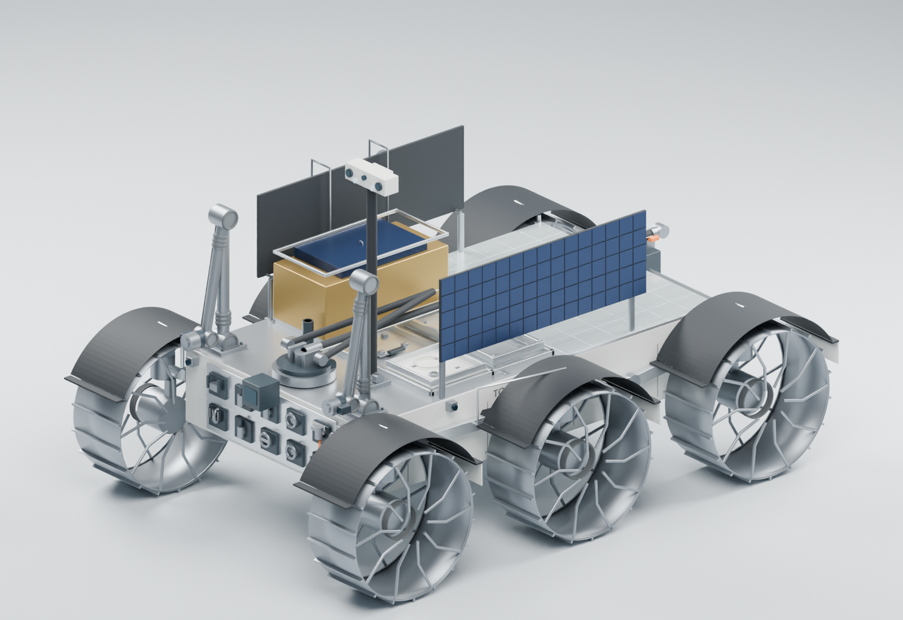

# TODARO CORP. TSR-1 — Blender engineering model

Frozen dedicated lunar service and recovery rover, reconstructed from engineering commit `95f06abd408712dffba3958a1003227ca7db70d2`.

Open **[TSR1.blend](TSR1.blend)** in Blender. The scene selector provides TRAVERSE, SERVICING, RECOVERY, EMERGENCY_POWER, LANDER_STOW and an additional 12° slope recovery pose. Geometry is in metres with editable subsystem collections and pivots. [GLB](TSR1_engineering.glb) and [FBX](TSR1_engineering.fbx) depict the traverse assembly and have been re-imported to verify integrity and scale.

The model opens in a clear material-preview view. Use the scene selector at the top right to change configuration and the Outliner to inspect subsystems. Enable viewport overlays to reveal joint axes, cameras and other editing guides. Documentation and reproducible source files are also available in Blender's Text Editor; no script runs automatically when the project opens.

Delivered validation: **63/63 dimensional checks passed**, 14 rendered views, 36 sampled steering positions, 20 sampled rocker/bogie positions and 54 sensor sightlines. These are bounded concept-geometry checks, not a manufacturing or full-motion qualification.

Read [build notes](BLENDER_BUILD_NOTES.md), [measured geometry validation](BLENDER_GEOMETRY_VALIDATION.md), [geometry/access review](BLENDER_GEOMETRY_REVIEW.md) and [conflict log](BLENDER_CONFLICT_LOG.md) before interpreting this as a physically qualified mechanism. The frozen ±90° steering claim is not reconciled with the closed-body swept envelope; it remains an explicitly documented engineering issue.

Other provenance: [requirements](BLENDER_MODEL_REQUIREMENTS.md), [source traceability](BLENDER_SOURCE_TRACEABILITY.md), [materials](BLENDER_MATERIAL_TRACEABILITY.md).

## Render gallery

| Technical | Functional |
|---|---|
| [Front-left](renders/01_iso_front_left.png) | [Traverse](renders/08_traverse.png) |
| [Rear-right](renders/02_iso_rear_right.png) | [Servicing](renders/09_servicing.png) |
| [Front](renders/03_front.png) | [Anchored recovery](renders/10_recovery.png) |
| [Rear](renders/04_rear.png) | [Emergency power](renders/11_emergency_power.png) |
| [Left](renders/05_left.png) | [Lander stow](renders/12_lander_stow.png) |
| [Right](renders/06_right.png) | [Lunar 1° Sun](renders/13_lunar_south_pole.png) |
| [Top](renders/07_top.png) | [Recovery 12° slope](renders/14_recovery_slope_12deg.png) |

[Build and reproduction instructions](BLENDER_BUILD_NOTES.md#rebuild-and-verify). No source engineering file is modified by this visualization.
